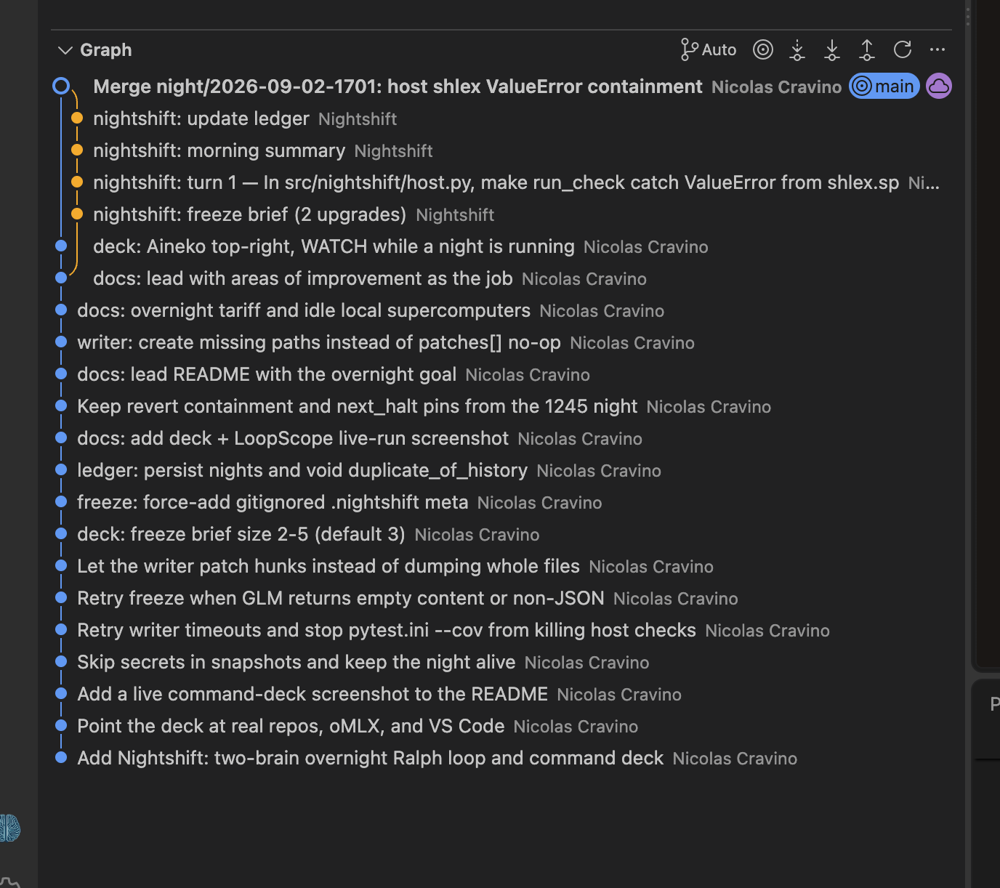
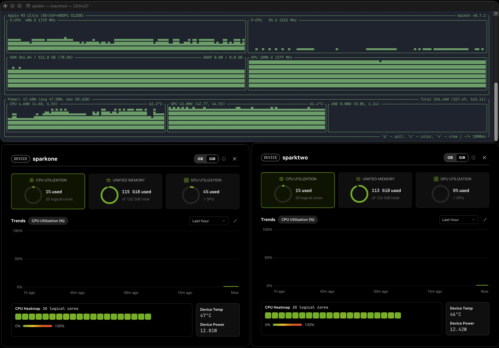
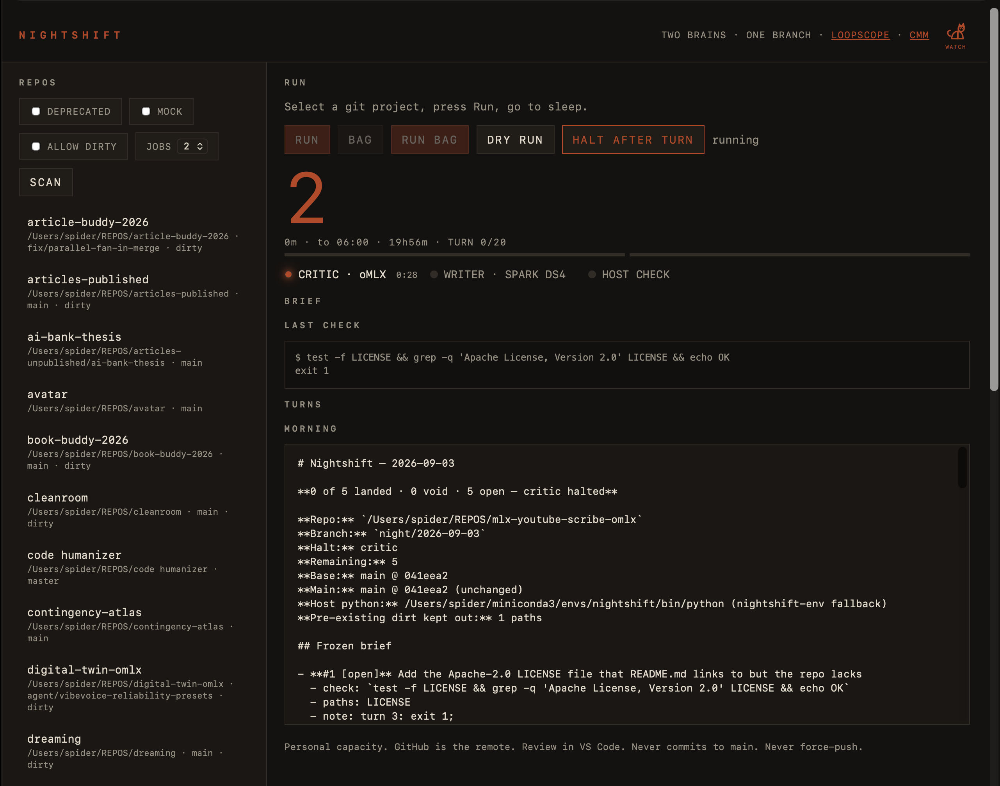
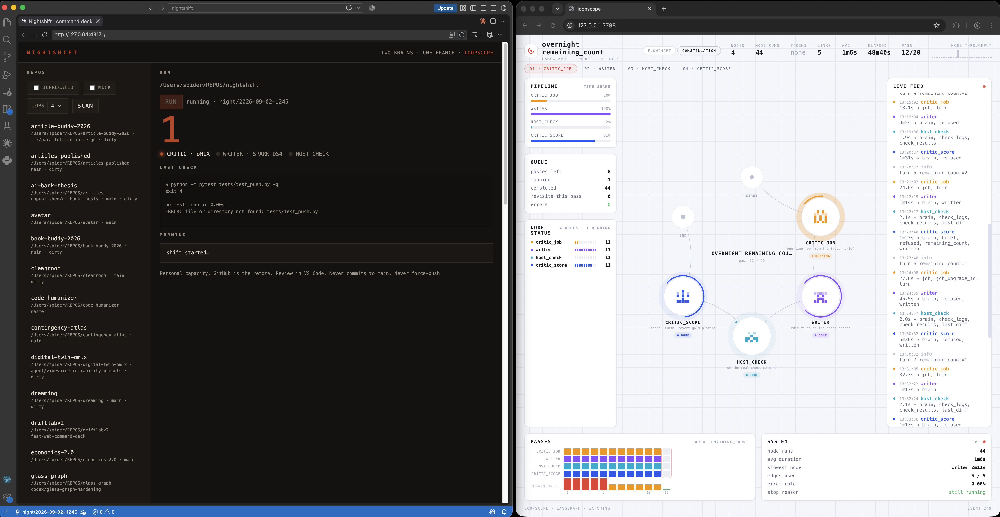

#  Nightshift

[](https://www.python.org)
[](https://github.com/langchain-ai/langgraph)
[](https://github.com/sw30labs/loopscope)
[](LICENSE)

Overnight **areas of improvement** across a **portfolio**, not one clone. Pick a git project, or pick **tonight's bag**. Nightshift freezes checkable upgrades, works them on the overnight tariff, and leaves you branches. `main` is never touched. You decide what lands. This is not a chatbot. The product is a `git diff`.

What shipped:

- **Portfolio bag** — `nightshift bag` / deck **BAG** + **RUN BAG**. Sequential nights (default 2, max 3) against one writer and one critic. Recency, CMM holes, optional `~/.nightshift/prior.json` liked/skip.
- **Meta RSI** — every bag includes Nightshift itself unless `--skip-meta`. Orange on the RSI graph is Nightshift writing Nightshift. You still merge.
- **Shared forum** — `~/.nightshift/forum.json` + `forum.md`. Publish after halt. A `shlex` catch in this repo is visible at freeze on the next target. Not a chat.
- **CMM atlas (local)** — `nightshift cmm` / deck **CMM**. Histogram over the forum. Empty L1–L5 until evidence. No invented scores. Atlas is Later.

Electricity is cheaper at night. The local supercomputers are already paid for: two NVIDIA Sparks and a 512 GB Mac Studio. Leave them dark and that capex earns nothing until morning. Same machines, cheaper electrons, a frozen brief, branches you review when you wake up.

Each night: minute 0, the critic walks the tree, tests, README, recent log, the clone ledger, and a ranked excerpt of the **other-repo** forum. It freezes **2–5 checkable upgrades** (deck **JOBS**, default **2**). Not “cleaner architecture.” Each item has a host command that can pass or fail. The writer cannot grow the brief. Last night’s attempted checks get **voided**, not retried.

Then a Ralph loop until remaining is 0, the clock (default 06:00 local), or `max_turns`: critic jobs the next open item, Spark DS4 writes, **host pytest is truth** (only the current job can be marked done, and only if its `paths[]` changed this night), critic reverts gold-plating. The same host failure three times voids that job and unlocks the next. Morning you get:

- `night/YYYY-MM-DD[-HHMM]` per target — **`main` never touched**
- a [LoopScope](https://github.com/sw30labs/loopscope) replay
- `.nightshift/summary.md` — done, void, remaining
- `forum.md` + a CMM histogram at estate grain (`nightshift morning --portfolio`)

Merge it, cherry-pick it, or delete it. Now / Next / Later: [ROADMAP.md](ROADMAP.md).


*The loop. Forum is the hub. Meta Nightshift is always in the bag. You still merge.*


*Eight cheap hours. One writer, one critic, two nights. `bag.json` stays running in the gap. Aineko WATCH until 06:00.*


*Capability, not implication. L3 does not require L2. L5 does not require L4. Empty until the forum has rows.*



*RSI in git. Orange is the night (Nightshift writing Nightshift). Blue is `main`. The bag always includes this repo unless you `--skip-meta`. You still merge.*

Personal-capacity OSS. GitHub is the remote. Morning review is VS Code, not Cursor. Author: Nicolas Cravino / sw30labs.

## Two lenses (not two checkboxes)

**Design effectiveness** is the freeze you already have: is the control *as written* (tests, README, git log) actually checkable tonight.

**Operational effectiveness** is memory of it running: `.nightshift/ledger.json`, rotated `history/`, last host checks. No evidence in this clone means no OE item. Freeze still cannot grow; void can shrink. **JOBS N is the total bag**, not DE + OE separately. The deck does not have DE/OE checkboxes.

## The two brains

Different physics. Do not point both at the same server.

| Role | Machine | Default endpoint | Model | Tools |
|---|---|---|---|---|
| **Writer** | Spark DS4 only | `http://192.168.86.44:8000/v1` | `deepseek-v4-flash` | edit/create files inside the target repo. No network from the writer. |
| **Critic** | Mac oMLX only | `http://127.0.0.1:8000/v1` | `GLM-5.3-Flash-MLX-8bit` | inspect, score, slash, revert, halt. **Never writes the project body.** |

OpenAI-compatible `POST /chat/completions`. Mac oMLX requires `Authorization: Bearer test`. Spark DS4 usually ignores the header.

```bash
export NIGHTSHIFT_WRITER_BASE_URL=http://192.168.86.44:8000/v1
export NIGHTSHIFT_WRITER_MODEL=deepseek-v4-flash
export NIGHTSHIFT_CRITIC_BASE_URL=http://127.0.0.1:8000/v1
export NIGHTSHIFT_CRITIC_MODEL=GLM-5.3-Flash-MLX-8bit
export NIGHTSHIFT_API_KEY=test           # oMLX; Spark usually ignores Authorization
export NIGHTSHIFT_ROOTS=$HOME/REPOS      # default
export NIGHTSHIFT_HALT_AT=06:00          # local clock
export NIGHTSHIFT_BRIEF_SIZE=2           # 2-5; deck JOBS knob
export NIGHTSHIFT_BAG_SIZE=2             # 1-3 sequential nights; always meta unless --skip-meta
export NIGHTSHIFT_FORUM=1                # 0 skips forum publish and the freeze excerpt
```

The cloud CI VM has neither oMLX nor the Sparks. Tests use `--mock` / `NIGHTSHIFT_MOCK=1`. Do not require live GPUs in CI.

Live confirm a night started is GPU activity, not a deck click:



*oMLX critic pinning the Mac Studio GPU (100% @ 1379 MHz, 361 / 512 GB). sparkone / sparktwo sit quiet until the writer turn. That is the proof the bag is alive.*

## Install

From a source checkout, same shape as LoopScope:

```bash
./setup_and_run.sh          # conda env + tests + mock deck over ~/REPOS
./setup_and_run.sh --live   # oMLX + spark-serve ds4
./setup_and_run.sh --demo   # seeded widget only
```

`--setup-only` stops after deps and tests. `--live` fills the two-brain URLs if they are unset. The deck binds `127.0.0.1:43171` by default (`NIGHTSHIFT_PORT` / `--port`); LoopScope stays on `:7788`.

Python 3.11+, via conda (Miniconda/Miniforge). `setup_and_run.sh` creates and
uses a `nightshift` conda env (`NIGHTSHIFT_CONDA_ENV` to rename it). By hand:

```bash
conda create -n nightshift -c conda-forge python=3.11 pip
conda activate nightshift
pip install -e ".[dev]"
```

LoopScope is optional but preferred. Same env:

```bash
pip install git+https://github.com/sw30labs/loopscope.git
```

If LoopScope is missing, Nightshift still runs: JSONL at `.nightshift/events.jsonl` plus a tiny stdlib page on `:7788`.

LangGraph is a hard dependency (the cycle graph). A plain state-machine fallback is used only if the import fails.

## Command deck

Stdlib HTTP. No React, no Vue, no Next, no Tailwind-as-a-framework.

```bash
nightshift serve --mock --demo          # VM / laptop without GPUs
nightshift serve                        # live Mac: oMLX + spark-serve ds4
```

Defaults to `http://127.0.0.1:43171`. Lists git repos under `NIGHTSHIFT_ROOTS` (default `~/REPOS`; skip `DEPRECATED` unless toggled). Click one, set **JOBS** 2–5, press **Run**. Or **BAG** / **RUN BAG** for tonight's sequential queue (JOBS applies to every night in the bag). Live `remaining_count`, which brain is hot, last host-check output, LoopScope link, bag list, then `summary.md` after halt. **CMM** in the header is the local histogram. Aineko WATCH while a night or a bag is running (including the gap between bag nights). No DE/OE checkboxes.

`--demo` seeds a failing `widget` repo so the list is not empty.





## CLI (equally first-class)

```bash
nightshift list
nightshift run /path/to/repo
nightshift run /path/to/repo --mock --brief-size 4
nightshift run /path/to/repo --dry-run          # freeze a brief, write nothing
nightshift run /path/to/repo --allow-dirty      # keep your WIP out of the night
nightshift bag                                  # select tonight's targets; write bag.json idle
nightshift bag --run --mock                     # lock + sequential nights
nightshift bag --skip-meta --meta-last --size 3
nightshift status                               # human block; --json for the full dict
nightshift status --bag                         # night board plus the bag queue
nightshift morning /path/to/repo                # 7am read + land commands
nightshift morning --portfolio                  # forum.md + CMM histogram + land lines
nightshift forum                                # portfolio ledger (human)
nightshift forum ingest                         # latest-entry projection from clone ledgers
nightshift forum mark-merged /path [night/…]    # cherry-picked keepers (L5 evidence)
nightshift cmm                                  # local histogram; --json for cmm.json
nightshift turns /path/to/repo                  # per-turn tape (LoopScope is the movie)
nightshift halt                                 # stop after the current turn (sets halt_bag if a bag is live)
nightshift serve --host 127.0.0.1 --port 43171
```

`--push` is off by default. Nightshift never force-pushes, never amends, never deletes your branches, never commits to `main`/`master`. `run` / RUN / RUN BAG refuse while a bag or shift is live. `bag` without `--run` does not call the critic.

## Tonight's bag, forum, CMM

`nightshift bag` scans `NIGHTSHIFT_ROOTS`, skips dirty / in-progress / `night/*` (same dirt as `run`), prefers CMM holes then recency, and always includes meta Nightshift unless `--skip-meta`. Optional `~/.nightshift/prior.json` `{"liked": […], "skip": […]}` is the only v0 pin list — no GitHub stars, no `git remote` parsing.

`bag --run` takes a durable lock (`bag.json` `state=running` + live pid) and runs nights **one after another** against the one writer and one critic, sharing the 06:00 deadline. One repo crash does not abort the bag. HALT sets `halt_bag` even between nights. Ctrl-C leaves the bag `halted`, not `done`.

Morning at estate grain: `nightshift morning --portfolio` prints `forum.md`, the CMM histogram, and land commands. `nightshift cmm` writes `~/.nightshift/cmm.json` and `cmm.html` (system fonts, no Google Fonts). Unobserved clones stay L0. L1–L5 stay empty until the forum has evidence. Mock nights count.

## Overnight contract

Minute 0, critic only (no writer, no project-body writes):

1. Pre-flight (clean tree, `halt_at` is HH:MM, both brains answer `/models` unless `--mock`). Freeze the brief against **current HEAD** (the base). Then create and checkout `night/YYYY-MM-DD` (append `-HHMM` if that name exists). It does not reset to `main`. A freeze failure leaves you on the base; no orphan branch.
2. Read tree, tests, README, recent git log, and a ledger excerpt (clone + home shard). Freeze also gets a ranked 8 KB excerpt from the **other-repo** forum. Writer turns do not.
3. Emit a **frozen brief**: 2–5 upgrades (`NIGHTSHIFT_BRIEF_SIZE`, CLI `--brief-size`, or deck JOBS).
Each must be checkable by a host command. If the repo has no tests, one item may be adding a smoke test that fails then making it pass.
4. Persist `.nightshift/brief.json` on the night branch. After freeze the writer cannot add extra upgrades. The critic cannot quietly expand scope at 3am.
Duplicates of ledger entries with the same check plus paths and `attempted=True` are **void** (`duplicate_of_history`). A prior attempt that did not land voids as `failed_before:<night>`. `remaining_count` = not done and not void. Void shrinks; freeze cannot grow.
5. Job lock: each turn works the first remaining item with turn budget left (`NIGHTSHIFT_JOB_TURNS`, default 4); budgets rotate until remaining is 0, the clock, or max_turns. The critic `upgrade_id` is ignored.

Then Ralph until `remaining_count == 0` or clock halt:

1. Critic writes a one-line job from the locked remaining item.
2. Writer edits files on the night branch (`patches[]` hunks; full `files[]` only for new or tiny files).
3. **Host** runs the real check commands. Pytest output is truth, not the model opinion. Void items are skipped.
4. Critic reads the diff and check logs, marks items that actually pass, and **reverts** gold-plating and files outside the brief.
Unapproved paths are restored. New untracked files are unlinked. Reverts skip parent-directory and absolute paths. Critic score cannot un-done or un-void.
5. LoopScope shows writer vs critic as two colours; `remaining_count` is the plot.

Morning artifacts on the night branch:

- `.nightshift/brief.json`
- `.nightshift/summary.md` (what changed, what was refused, voided/skipped-as-duplicate, remaining if the clock halted)
- small real commits as the night proceeds

Ledger of prior nights lives at `.nightshift/ledger.json` plus a home shard under `~/.nightshift/ledger/`. `events.jsonl` is rotated into `.nightshift/history/{UTC stamp}/` before truncate.
End of night force-adds the ledger (`.nightshift/` is gitignored) and **publishes** to `~/.nightshift/forum.json` (after halt, never from the writer, never on `--dry-run`).

Self-run (Nightshift on Nightshift) is allowed only when you pick it explicitly, or when it is the bag's **meta** target. Portfolio targets stay `explicit=False`.

## LoopScope

One hook. Nightshift does not fork LoopScope and does not wrap graph nodes.

A single night is Ralph + LangGraph (`critic_job` → `writer` → `host_check` → `critic_score`). A **bag** is an outer Ralph (`select` → `night` → `forum`), one pass per target. LoopScope keeps the bag constellation; each inner night is a nested run in the feed, not a second dashboard. `:7788` is started once for the bag (`~/.nightshift/bag-events.jsonl`). Inner `run_night` does not steal the port.

```python
import loopscope
scope = loopscope.start(open_browser=True)
config = loopscope.attach(app)
# invoke / astream
loopscope.finish(config)
scope.hold()
```

Dashboard default: `http://127.0.0.1:7788`. Overnight replay:

```bash
python -m loopscope.replay path/to/repo/.nightshift/events.jsonl --speed 8
python -m loopscope.replay ~/.nightshift/bag-events.jsonl --speed 8
```

## Mock mode

```bash
nightshift run ./some-repo --mock --no-observe
nightshift bag --run --mock --no-observe
NIGHTSHIFT_MOCK=1 nightshift serve --demo
pytest
```

The mock provider implements the same chat shape as the live HTTP clients. Unit and integration tests stay green with no Spark and no oMLX.

## Safety

- Target must be a git work tree. Always branch first; never commit to `main`/`master`.
- Refuse a dirty tree, a merge/rebase in progress, and detached HEAD (or pass `--allow-dirty` / ALLOW DIRTY, which keeps your WIP out of commits and voids jobs whose `paths[]` intersect it).
- Refuse `/` and `$HOME`. Refuse Nightshift's own repo unless you explicitly selected it.
- Cap turns (default 20) and wall clock (halt-at).
- Writer tools: edit or create inside the target only. Critic has no write tool.
- Snapshot is gitignore-aware and never reads `.env`, keys, or credential files.
- A blocked secret write is skipped and recorded, not a dead night. Secret rotation is a human job.
- Writer HTTP timeout defaults to 600s; a timeout is recorded and retried next turn, not a dead night.
- Host checks run in the target repo under the resolved interpreter (override / `.venv` / `environment.yml` / conda env named after the repo directory / Nightshift's own Python). Pytest CI addopts (`--cov`, …) are stripped so a missing pytest-cov cannot kill the check.
- No `git push` unless `--push`.
- HALT AFTER TURN (`nightshift halt` / deck button) finishes the current turn, then writes summary + ledger. If a bag is live it also sets `halt_bag` so the rest of the queue does not start. Ctrl-C does not write a night summary; a live bag becomes `halted`.
- A second `nightshift run`, deck RUN, or RUN BAG is refused while a bag or shift is live (including the gap between bag nights). Stale locks recover only when the pid is dead. This process is never treated as dead.
- LoopScope is the movie. `nightshift turns` is the transcript (`.nightshift/turns.jsonl` on the night branch).

Host python precedence: `NIGHTSHIFT_TARGET_PYTHON` or `.nightshift/host.json` `{"python": …}`, then `.venv`/`venv`, then `environment.yml` `name:`, then a conda env whose directory name equals the repo directory, then Nightshift's own interpreter. The source is printed on `run` / `--dry-run` and in the morning summary.

## Tests

```bash
pytest
```

Covered: brief freeze (cannot add extra upgrades once frozen; size 2-5), void plus ledger duplicate, critic cannot write files, host-check truth, branch naming, revert of unapproved paths (including parent-dir skip), mock end-to-end to remaining_count 0 on a fixture git repo, command deck list plus Run, forum publish/reuse, CMM predicates, bag select/run plus the bag lock, deck BAG / RUN BAG / `/cmm`.
Fixture path: failing tests, then patches, then real pytest, then summary.md, then night branch exists and main is unchanged. Tests never run a night on this checkout.

## Layout

```
src/nightshift/
  cli.py         list / run / bag / status / serve / morning / turns / halt / forum / cmm
  deck.py        stdlib HTTP command deck (RUN, BAG, RUN BAG, /cmm)
  bag.py         tonight's queue + durable lock
  forum.py       ~/.nightshift/forum.json + forum.md
  cmm.py         local evidence histogram
  runner.py      overnight contract (publishes after halt; stops observe)
  graph.py       LangGraph cycle plus snapshot / revert
  llm.py         OpenAI-compat clients, mock provider, writer, critic
  host.py        real check commands + interpreter resolution
  gitops.py      branch, commit, revert (never force)
  ledger.py      prior-night memory; void duplicate_of_history
  summary.py     morning markdown / terminal view
  observe.py     LoopScope hook plus JSONL fallback
```

Apache-2.0. Copyright 2026 Nicolas Cravino.

