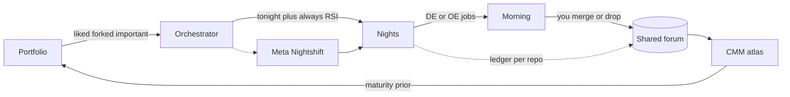
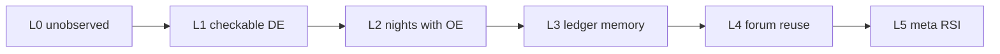

#  Nightshift roadmap

Vision, not a schedule. Today is still: pick a repo, freeze two checkable upgrades, sleep, merge or drop. This page is the thing that is not built yet.

The product stays a `git diff`. `main` is never touched. You still decide what lands.

## The loop

An orchestrator looks at the portfolio — the repos you actually care about (important, liked, forked, recently alive) — and picks **tonight's bag**. Always include **meta Nightshift**: squeeze RSI out of the tool that runs the nights. Then it starts and monitors one Nightshift per selected repo. Morning you get branches, not a chatbot.

Jobs still come from two lenses, one bag:

- **DE** — the control as written (tests, README, git log). Is it checkable tonight.
- **OE** — memory of it running (`.nightshift/ledger.json`, rotated `history/`, last host checks). No evidence in the clone means no OE item.

Sometimes the freeze is DE. Sometimes it is run-logs. Never both as fake checkboxes.

Cross-repo state lives in a **shared forum**, not only in per-clone silos. The **CMM atlas** is a histogram of maturity over that forum: where each project sits, how it moved, what transferred.

Editorial rendering (stone / rust, Aineko on the header): [docs/roadmap-loop.html](docs/roadmap-loop.html) · [docs/roadmap-cmm.html](docs/roadmap-cmm.html)

## Shared forum

Tonight each clone keeps `.nightshift/` to itself. That is a silo.

The forum is the portfolio ledger: which checkable upgrade ran, on which repo, whether host pytest passed, what got voided, what a later night should not retry. A host `shlex` catch that saved Nightshift should be visible to the next target, not only to `nightshift`'s own history.

Not a chat. A state file (or Atlas page) you can read in the morning at portfolio grain.

## CMM atlas

Capability maturity as assessment, not as theatre. Empty columns until nights have written evidence. No invented scores.

| Level | Name | Evidence |
|---|---|---|
| L0 | Unobserved | In `~/REPOS` or GitHub, never frozen |
| L1 | Checkable DE | At least one freeze from tests / README / log |
| L2 | Nights with OE | A night ran; host checks exist |
| L3 | Ledger memory | Void / duplicate-of-history is doing work |
| L4 | Forum reuse | Another repo consumed a recorded improvement |
| L5 | Meta RSI | Nightshift improved Nightshift, and you merged it |

Histogram over repos, over time. Atlas-shaped: you can see the estate, not one clone.

## Always squeeze meta

Orange nights on this repo are the RSI graph you already have. The orchestrator does not treat that as optional. Every bag includes Nightshift itself (or a slice of it) unless you explicitly skip. Recursive self-improvement is the point of paying for idle Sparks and a 512 GB Mac Studio after dark.

## Now / next / later

**Now** (this repo): one target, JOBS default 2, DE+OE freeze, per-clone ledger, meta when you pick `nightshift`, human merge.

**Next:** orchestrator picks N targets from the portfolio prior (stars, forks, liked, recency, CMM holes). Starts and watches those nights. Always meta. Shared forum v0 (one JSON/Markdown the mornings can read).

**Later:** CMM atlas as a real histogram in Atlas, forum patterns that travel, multi-night monitor on the command deck, Aineko WATCH while any of the bag is running.

Aineko stays on the header, far right on GUIs, left of the title on GitHub READMEs. Every new surface gets the cat.
