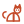
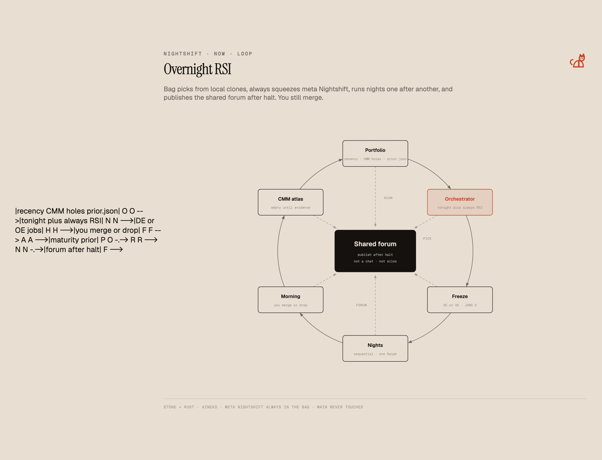
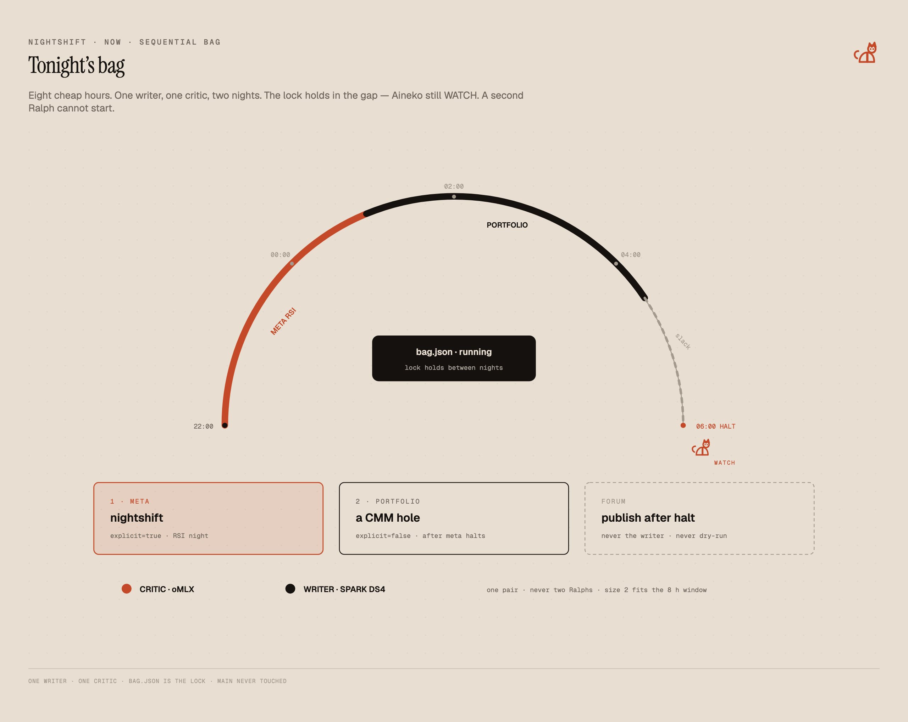
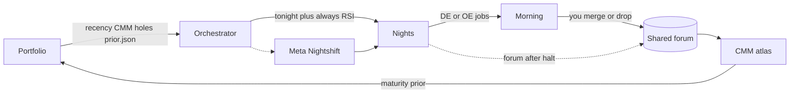
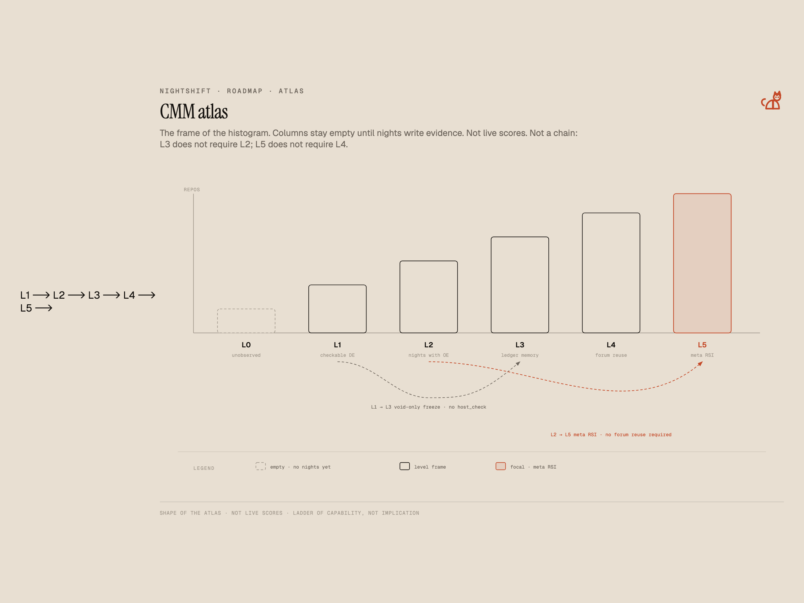
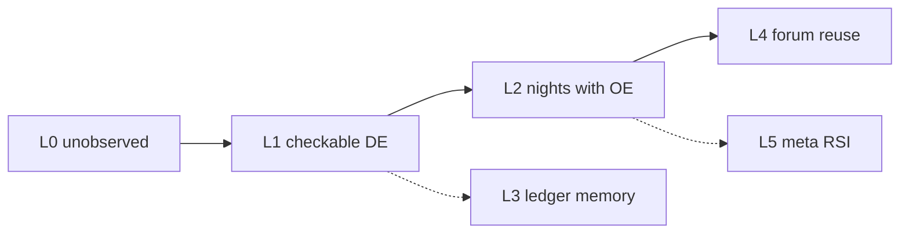

#  Nightshift roadmap

Vision, not a schedule. Today: pick a repo, or pick **tonight's bag**. Freeze two checkable upgrades, sleep, merge or drop. The product stays a `git diff`. `main` is never touched. You still decide what lands.

## The loop

`nightshift bag` looks at local clones under `NIGHTSHIFT_ROOTS` (default `~/REPOS`) — recency, CMM holes, optional `~/.nightshift/prior.json` liked/skip — and picks **tonight's bag**. Always include **meta Nightshift** unless `--skip-meta`: squeeze RSI out of the tool that runs the nights. Nights run **one after another** against the one writer and one critic. Morning you get branches, not a chatbot.

Jobs still come from two lenses, one bag:

- **DE** — the control as written (tests, README, git log). Is it checkable tonight.
- **OE** — memory of it running (`.nightshift/ledger.json`, rotated `history/`, last host checks). No evidence in the clone means no OE item.

Sometimes the freeze is DE. Sometimes it is run-logs. Never both as fake checkboxes.

Cross-repo state lives in a **shared forum**, not only in per-clone silos. The **CMM atlas** is a histogram of maturity over that forum: where each project sits, how it moved, what transferred.

Editorial rendering (stone / rust, Aineko on the header): [docs/roadmap-loop.html](docs/roadmap-loop.html) · [docs/readme-bag.html](docs/readme-bag.html) · [docs/roadmap-cmm.html](docs/roadmap-cmm.html)

## Shared forum

Each clone still keeps `.nightshift/ledger.json` as the void prior for **that** tree. That is not the estate.

The forum is `~/.nightshift/forum.json` plus human `forum.md`: which checkable upgrade ran, on which repo, whether host pytest passed, what got voided, what a later night should not retry. A host `shlex` catch that saved Nightshift is in the freeze snapshot of the next target (ranked 8 KB, other repos only). Exact-key reuse is recorded at publish. The writer never sees the excerpt. Dry-run never publishes.

Not a chat. `nightshift morning --portfolio` / `nightshift forum`. GitHub stars and an Atlas page are Later.

## CMM atlas

Capability maturity as assessment, not as theatre. `nightshift cmm` / deck **CMM** is a local histogram over the forum. Empty columns until nights have written evidence. No invented scores. No cloud LLM. Atlas ingest of `cmm.json` is Later.

| Level | Name | Evidence |
|---|---|---|
| L0 | Unobserved | In the histogram population, no forum freeze |
| L1 | Checkable DE | At least one freeze from tests / README / log |
| L2 | Nights with OE | A night ran; host checks exist |
| L3 | Ledger memory | Void / duplicate-of-history is doing work |
| L4 | Forum reuse | Another repo consumed a recorded improvement |
| L5 | Meta RSI | Nightshift improved Nightshift, and you merged it |

Histogram over repos under roots (plus the meta checkout if it is missing). A repo is counted once, at its max level. L3 does not require L2. L5 does not require L4. L5 needs a forum `done` row **and** a merge (or `forum mark-merged` for cherry-picked keepers) — never “HEAD is main,” never a home shard.

## Always squeeze meta

Orange nights on this repo are the RSI graph you already have. The orchestrator does not treat that as optional. Every bag includes Nightshift itself unless `--skip-meta`. Recursive self-improvement is the point of paying for idle Sparks and a 512 GB Mac Studio after dark.

## Now / next / later

**Now:** one target (`run` / RUN) **and** a sequential bag (`bag` / BAG / RUN BAG). JOBS default 2. DE+OE freeze, no checkboxes. Per-clone ledger plus home shards. Shared forum v0 (`forum.json` / `forum.md`). Local CMM histogram. Always meta unless you skip. Bag lock so a second Ralph cannot start in the gap between nights. Aineko WATCH while a night **or** a bag is running. Human merge.

**Next:** optional GitHub prior when `gh` exists (stars/forks, 2 s, fail-open). CMM as a real histogram page in Atlas — Atlas reads `cmm.json`; Nightshift does not import Atlas.

**Later:** forum patterns that travel (basename / check-kind, still no embeddings), deck monitor for the whole bag as first-class, parallel Ralphs, Aineko WATCH-any of a parallel bag.

Aineko stays on the header, far right on GUIs, left of the title on GitHub READMEs. Every new surface gets the cat.
