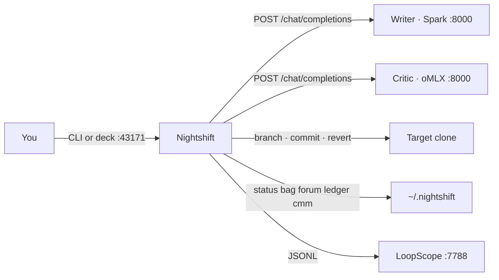
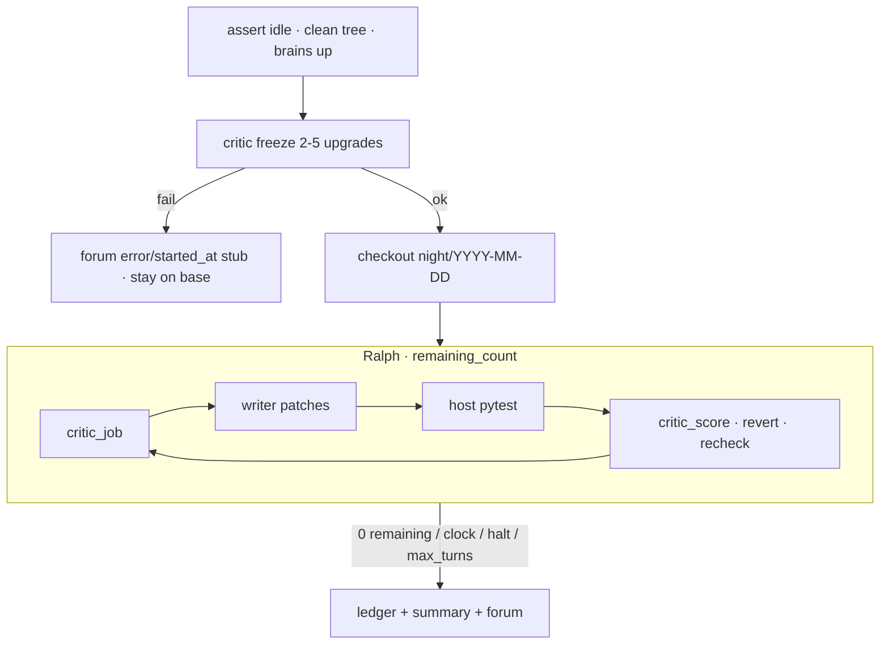
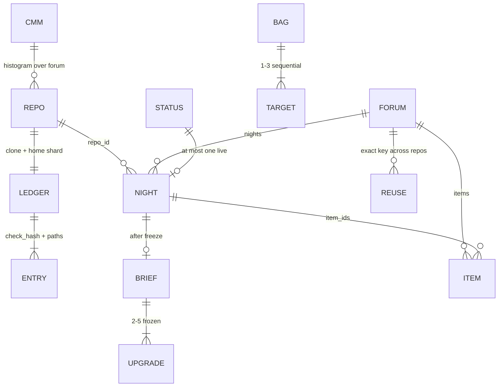

# Architecture

One process. Two LLMs. One live night. JSON files under `~/.nightshift`. Git is the store of record.

```
CLI / deck  →  bag (optional)  →  run_night  →  night/* branch
                                      ↓
                               forum.json  →  CMM (derived)
```

## Context



Writer never sees the forum excerpt. Critic freeze does. Host checks are local subprocesses — not an LLM.

## A night



A **bag** is an outer Ralph (`select` → `night` → `forum`) under `bag.json` `state=running` + live pid. Nights run one after another against the same writer and critic. Inner nights do not steal `:7788`.

## Data



Grain:

| File | Grain | Writer |
|---|---|---|
| `status.json` | **this** running night | runner / deck, merge-on-disk |
| `halt.request` | one pid, consume-once | halt; runner unlinks |
| `bag.json` | tonight's queue + lock | select / run_bag / halt |
| `forum.json` + `forum.md` | **estate** | publish after halt, ingest |
| `ledger/<sha12>.json` + clone `.nightshift/ledger.json` | **one clone** void prior | end of night |
| `.nightshift/brief.json` | this night's freeze | persist after freeze |
| `cmm.json` / `cmm.html` | derived | `nightshift cmm` / deck CMM |
| `prior.json` | operator liked/skip | you |

`repo_id` = `sha1(resolved path)[:12]`. Item key that crosses repos = `check_hash + paths` (no `repo_id`). Night upsert key = `(repo_id, night)`; freeze-fail stubs use `night=error/<started_at>` ([N1](design-portfolio-forum-cmm.md)).

Do not put bag fields on `RunStatus`. A new night `reset()`s the board.

## Locks

`fcntl.LOCK_EX` on `~/.nightshift/<name>.lock`, then unique-temp `os.replace`. Names: `forum`, `bag`, `status`, `halt`, `cmm`.

Liveness is `pid_alive` (this pid is alive). Do not use `status.live_owner` for bag or deck-started nights — that helper returns false for the deck's own pid.

`run` / RUN / RUN BAG refuse while a bag or shift is live, including the gap between bag nights. Stale `running` recovers only when the pid is dead.

## Modules

| Module | Job |
|---|---|
| `runner.py` | overnight contract, three publish paths |
| `graph.py` | freeze snapshot, Ralph cycle, revert + recheck |
| `llm.py` | OpenAI-compat writer / critic / mock |
| `host.py` | real checks, interpreter, strip CI addopts |
| `gitops.py` | branch, `--only` commit, revert; never force |
| `bag.py` | select + sequential run + lock |
| `forum.py` | estate ledger, excerpt, reuse events |
| `cmm.py` | evidence histogram, no LLM |
| `status.py` | live board |
| `deck.py` | stdlib HTTP |
| `cli.py` | same verbs as the deck |

## Safety, short

Target is a git work tree. Never commit to `main`/`master`. Writer stays inside `paths[]`. Snapshots skip secrets and symlink escapes. Scoped commits use `git commit --only` so your staged WIP survives. Deck POST is same-origin JSON only.

Decisions: [adr/](adr/). Contract: [design.md](design.md). Historical notebook (N1–N10): [design-portfolio-forum-cmm.md](design-portfolio-forum-cmm.md).
