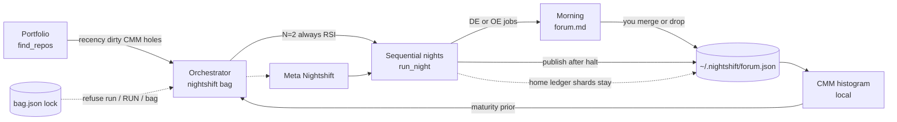
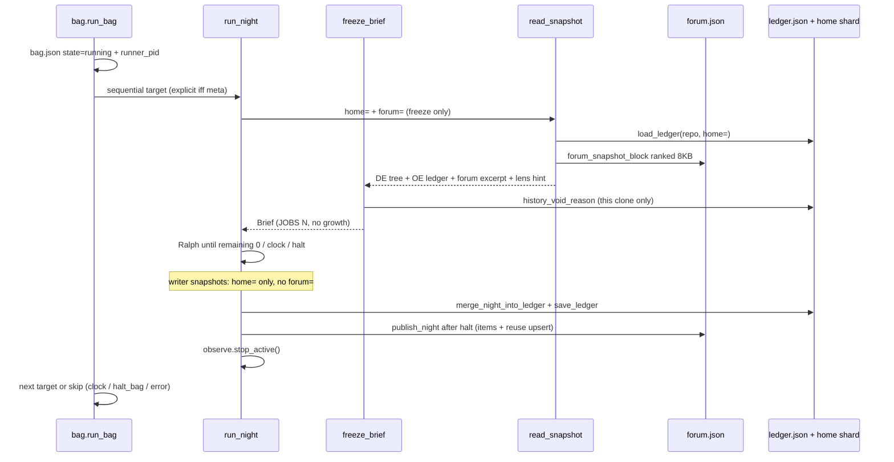

# Nightshift: Portfolio orchestrator, shared forum, CMM atlas

| Field | Value |
|---|---|
| Author | Nicolas Cravino / sw30labs (personal-capacity OSS) |
| Date | 2026-09-03 |
| Status | Draft (rev 4) — implementation notes appended |
| Repo | `/Users/spider/REPOS/nightshift` (`https://github.com/sw30labs/nightshift`) |
| Baseline | `f50ce9a` — *Make nights land: job-first snapshot, clean-tree, morning CLI* |
| Audience | Senior engineers who already know this tree |

---

## Overview

Tonight Nightshift is a **single-target** overnight Ralph: pick one git work tree, freeze 2–5 checkable upgrades, sleep, merge or drop a `night/YYYY-MM-DD` branch. `main` is never touched. Per-clone `.nightshift/ledger.json` plus a home shard at `~/.nightshift/ledger/<sha12>.json` already remember what this clone attempted. The command deck (`:43171`) and `nightshift status` assume **one running night**. `cli.py` `cmd_run` does **not** refuse a second shift; only `DeckState.start_run` does. That is Now.

This design ships **Next** from [ROADMAP.md](ROADMAP.md): an orchestrator that picks **tonight's bag** from local clones under `NIGHTSHIFT_ROOTS` (default `~/REPOS`), **always includes meta Nightshift** unless `--skip-meta` (which removes the Nightshift checkout from the candidate set entirely), runs those nights **one after another** against the one writer (Spark DS4) and one critic (Mac oMLX), and writes a **shared forum** at portfolio grain. A durable **bag lock** (`bag.json` `state=="running"` + live pid) is what makes sequential nights safe: CLI `run`, deck RUN, `bag --run`, and RUN BAG all refuse while it is held. A local **CMM histogram** is a pure function over that forum: empty L1–L5 columns until nights have written evidence. No invented scores. No cloud LLMs. No DE/OE checkboxes.

The product stays a `git diff`. Morning you still get branches, not a chatbot.



---

## Background & Motivation

### Current state (Now, `f50ce9a`)

| Piece | Where | What it already does |
|---|---|---|
| Single-target CLI | `src/nightshift/cli.py` | `list` / `run` / `status` / `serve` / `morning` / `turns` / `halt`; `--dry-run`, `--allow-dirty`, `--mock`. **`cmd_run` does not check `live_owner`.** |
| Overnight contract | `src/nightshift/runner.py` | `run_night`, `dry_run_brief`, freeze-before-branch, `NightReport` |
| Per-clone + home ledger | `src/nightshift/ledger.py` | `.nightshift/ledger.json`; optional `~/.nightshift/ledger/<sha12>.json`; `duplicate_of_history` / `failed_before`; near-dup on source paths + title Jaccard ≥ 0.5. Home shard body is `{entries: [...]}` only — **no `repo_path`**. `merge_night_into_ledger` always writes `last_exit` (default 0), including halt-before-host rows. `_merge_entry_lists` keeps the **later `night` only** per `_entry_key`. |
| Status board | `src/nightshift/status.py` | singleton `~/.nightshift/status.json`; `halt.request` keyed by `runner_pid`. `StatusBoard.__init__` starts from empty `RunStatus()` and does **not** read the file. `update()` writes the full `asdict`. |
| Portfolio scan | `src/nightshift/repos.py` | `find_repos(roots)`, skip `DEPRECATED`, skip venv/node_modules. `_quick_status` dirty = any porcelain line except `.nightshift/` (**junk counts**). |
| Settings | `src/nightshift/config.py` | env-first; `NIGHTSHIFT_HOME` default `~/.nightshift`; JOBS via `brief_size` 2–5 default 2. `state_dir()` is `mkdir(parents=True)` under umask; live `~/.nightshift` is **0755**, not 0700. |
| Morning | `src/nightshift/summary.py` | `night_view` / `render_markdown` / `render_terminal` / land commands |
| Deck | `src/nightshift/deck.py` + `deck.html` | stdlib HTTP; stone/rust; Aineko far right; JOBS select; no DE/OE. **`start_run` refuses if `state=="running"`.** |
| Freeze snapshot | `src/nightshift/graph.py` `read_snapshot` | tests/README/log + **clone** ledger block (does **not** currently pass `home=`). Writer turns call `read_snapshot` every turn (~596). `LoopNodes.critic_job` **replaces** `ctx.turn_scratch` every turn (~563). |
| Observe | `src/nightshift/observe.py` | `start()` binds `:7788`; busy port → `_NullScope()`. `run_night` assigns `scope = observe_start(...)` and ends `_ = scope` — **never `stop()`s**. `FallbackScope.stop()` exists. |
| Meta guard | `src/nightshift/safety.py` `assert_safe_target` | refuses Nightshift's own repo unless `explicit=True`. `tree_state` / `assert_clean_tree` ignore junk and meta. |
| Tests | `tests/conftest.py` | `fixture_repo`, `mock_settings`, `ns_home` |
| `.nightshift/ledger.json` on this repo | git | force-tracked on `HEAD` despite `.gitignore` (`git ls-files` lists it) |

What Now does **not** do:

- Pick more than one target.
- Remember a host `shlex` catch (keeper `472e161` from night `1701`) anywhere except `nightshift`'s own ledger shards.
- Score maturity. Editorial frames exist (`docs/roadmap-cmm.html`) with **empty columns on purpose**.
- Survive `git branch -D` of a night **and** a deleted clone: home ledger shards survive, but they are keyed by `sha1(resolved_path)[:12]` with **no path stored inside**, so they are not a portfolio index.
- Refuse a second CLI `nightshift run` while a shift or bag is live.

Pain:

1. Operator has many clones under `~/REPOS`. Overnight tariff is ~8 h (halt-at 06:00). One target leaves the rest dark.
2. Cross-repo learning is tribal: Nic remembers the `shlex` catch; the next freeze on `loopscope` does not.
3. CMM without a forum is theatre. Scores invented by an LLM would violate the roadmap.

### Constraints that do not move

- `main` / `master` never touched. Human merges or drops in VS Code.
- Stdlib HTTP/UI. No React/Vue/Tailwind/Next. Hard dep: `langgraph`. Optional: `loopscope`. Conda env `nightshift`, Python 3.11+.
- Two local brains only: writer `http://192.168.86.44:8000/v1` `deepseek-v4-flash`; critic `http://127.0.0.1:8000/v1` `GLM-5.3-Flash-MLX-8bit`. `--mock` / `NIGHTSHIFT_MOCK=1` must stay green with no GPUs.
- Freeze cannot grow. Critic never writes the project body. Writer is path-locked to the current job's `paths[]`.
- DE and OE are two lenses, **one bag**. `JOBS N` is the total. No DE/OE checkboxes on the deck.
- Aineko on every new surface (header far right on GUIs; one-line mention on `forum.md`).
- Never read `.env`; never propose key rotation.
- Do not confuse with spark-serve/vLLM or DwarfStar.
- Live confirm a night started = Spark GPU / oMLX activity, not a deck click.
- Singularity Atlas is a **separate** project (historically SI=29.5). CMM "in Atlas" is Later. v0 is local.

### Hardware budget (why bag size is 2)

One operator. Mac Studio M3 Ultra (512 GB, oMLX critic) + two Sparks (writer on DS4). Overnight tariff, typical window 22:00–06:00 local = **8 h** until `NIGHTSHIFT_HALT_AT` default `06:00`.

| Budget | Value | Source |
|---|---|---|
| Writer HTTP timeout | 600 s | `Settings.writer_timeout` |
| Critic HTTP timeout | 180 s | `Settings.critic_timeout` (used by **both** `critic_job` and `critic_score`) |
| Host check timeout | 120 s | `Settings.check_timeout` |
| Ralph cap | 20 turns | `NIGHTSHIFT_MAX_TURNS` |
| Per-job rotation | 4 turns | `NIGHTSHIFT_JOB_TURNS` |
| JOBS default | 2 | `NIGHTSHIFT_BRIEF_SIZE` |

A turn is critic_job + writer + host_check + critic_score — **four HTTP/host phases**, two of them critic. Writer is the bottleneck. Worst-case turn ≈ 180+600+120+180 s ≈ **18 min of timeouts**, plus critic_job 180 s if that call also hits the cap → **~21 min**. Typical live turn is a few minutes. 20 turns × ~8 min typical ≈ **2.5–3 h per night**. Two sequential nights ≈ 5–6 h, fits the 8 h window with slack for freeze and morning. Three nights only if earlier nights halt `remaining_zero` quickly. Keep bag size default **2**.

**Both brains are single endpoints.** Two concurrent Ralphs would interleave writer jobs across repos on one Spark and one oMLX load. `StatusBoard` is a singleton file. LoopScope binds `:7788`. Parallel nights are a queue, not N writers.

---

## Goals & Non-Goals

### Goals (v0 = ROADMAP Next)

1. **Bag select.** From `find_repos()`, skip `DEPRECATED` unless toggled, skip dirty via `safety.tree_state` (unless `--allow-dirty`), skip in-progress/detached, skip a target on `night/*`. Prefer CMM holes (L0/L1), prefer recently alive (`git log -1 --format=%ct`). Always include meta Nightshift unless `--skip-meta`, which **drops `is_nightshift_repo` paths from the candidate set entirely**. Cap **N=2 including meta** (max 3 via flag). Optional `--meta-last`.
2. **Bag run.** Sequential `run_night(...)`. `explicit=True` **only** for the selected meta target; portfolio targets stay `explicit=False`. Shared `halt_at` deadline on a **copied** `Settings`. One repo crash does not abort the bag. Meta failure is logged; other targets still run. Durable bag lock (below).
3. **Forum v0.** One versioned JSON at `~/.nightshift/forum.json` plus human `forum.md`. Additive publish **after halt** from `NightReport` + ledger rows. Never from the writer. Never from an unmerged working tree as the only copy. Never at freeze.
4. **Forum reuse plumbing.** **Minute-0 freeze** snapshot includes a ranked, capped forum excerpt from **other** repos (the `shlex` catch becomes visible). Writer snapshots do **not** get the excerpt. L4 is a **pure mechanical event** computed at publish, not an LLM score.
5. **CMM v0.** Pure functions. **Forum-only for L1–L4** (no clone-ledger fallback). Histogram population = `find_repos()` plus the meta checkout if it is missing from roots. Unobserved stays L0. Empty L1–L5 until ingest or a live publish. L2 is `attempted is True` only. L5 needs a forum `done=true` item on an `is_nightshift_repo` path **and** git/`mark-merged` evidence, never a home shard.
6. **CLI + deck.** `nightshift bag` / `bag --run`, `status --bag`, `morning --portfolio`, `forum`, `cmm`. Deck **BAG** + **RUN BAG**. No DE/OE checkboxes. Aineko stays. All start paths refuse while the bag lock is held.
7. **Mock.** All of the above green under `--mock` in CI with `ns_home`.

### Non-goals (v0 must not block on these)

- Coupling to Singularity Atlas internals. No Atlas HTTP, no SI number, no snapshot-site layout.
- GitHub stars / forks / liked via `gh` **or** via `git remote` parsing. v0 prior channel is `~/.nightshift/prior.json` only.
- Pattern-language platform, embeddings, or cross-repo AST.
- Parallel Ralphs / N concurrent writers.
- Multi-night LoopScope WATCH-any-of-bag (Later). v0 WATCH = `status.state=="running"` **or** `bag.json state=="running"`.
- DE/OE GUI, split JOBS, or freeze growth.
- Touching `main`. Auto-merge. Force-push.
- Rewriting clone ledgers. Forum ingest is a **latest-entry projection**, not a full night journal.
- Cloud LLMs. New heavy deps. React.

### Later (sketch only)

- CMM as a real histogram page in Atlas (Atlas consumes `cmm.json`, Nightshift does not import Atlas).
- Forum patterns that travel (basename / check-kind match, still no embeddings).
- Deck monitor for the whole bag as first-class (not just merged `status.json` + `bag.json`).
- Aineko WATCH while **any** of a parallel bag is running.
- Optional `gh` prior when online (`NIGHTSHIFT_GH=1`, 2 s timeout, fail-open).

---

## Proposed Design

v0 is three small modules plus hooks into code that already exists:

| New module | Responsibility |
|---|---|
| `src/nightshift/forum.py` | `forum.json` / `forum.md` load-save-publish-ingest; freeze excerpt; reuse match at publish; flock helper |
| `src/nightshift/cmm.py` | `score_repo`, `histogram`; write `cmm.json` + stdlib `cmm.html` (no webfonts) |
| `src/nightshift/bag.py` | `select_bag`, `run_bag`, bag lock, stale recovery; `bag.json` |

Hooks: `runner.run_night` publishes on three paths, stops observe, copies nothing onto deck Settings; `graph.read_snapshot` gains `home=` (all snapshots) and `forum=` (**freeze only**); `cli.py` / `deck.py` call `assert_shift_idle`; `ledger.py` exports `repo_id()`. **Do not add bag fields to `RunStatus`.**

### 1. Where the forum lives

**Default: a new pair of files under `NIGHTSHIFT_HOME`, not inside any clone, not merged into home ledger shards.**

```
~/.nightshift/                 # live dir is 0755 (umask); not claimed 0700
  status.json                  # live *current night* only (Now shape)
  halt.request                 # Now
  ledger/<sha12>.json          # Now; per-clone prior; unchanged
  forum.json                   # NEW portfolio ledger (machine)
  forum.md                     # NEW morning read (human)
  forum.lock                   # NEW flock during publish/ingest
  bag.json                     # NEW queue + durable lock
  cmm.json                     # NEW derived snapshot (regenerable)
  cmm.html                     # NEW local histogram page (no Google Fonts)
  prior.json                   # OPTIONAL operator pin list
```

**Why not merge into `ledger/<sha12>.json`:** those shards are the void prior for **one clone**. They have no `repo_path`, no reuse events, no bag errors, no merged bit. Freeze already loads them via `load_ledger(repo, home=)`. Mixing portfolio grain into that file would break `history_void_reason` and the home-survives-deleted-night test (`tests/test_ledger_home.py`).

**Why not `.nightshift/forum.json` in a clone:** that is another silo. The point of the forum is that a `shlex` catch in `nightshift` is visible when the next target is `loopscope`.

**Alternative (rejected for v0):** SQLite. JSON matches `ledger.py` / `status.py` / `Brief.to_dict`, is grep-able at 7am, and stays stdlib. Size estimate: ~1–2 KB per night; 200 nights ≈ 0.4 MB.

**Atomic write + lock** (`forum.py`, reused by `bag.json` writes):

```python
def with_home_lock(home: Path, name: str, fn):
    lock_path = Path(home) / f"{name}.lock"
    lock_path.parent.mkdir(parents=True, exist_ok=True)
    fh = lock_path.open("a+")
    try:
        fcntl.flock(fh.fileno(), fcntl.LOCK_EX)
        return fn()
    finally:
        fcntl.flock(fh.fileno(), fcntl.LOCK_UN)
        fh.close()

def atomic_write_json(path: Path, data: dict) -> None:
    path.parent.mkdir(parents=True, exist_ok=True)
    tmp = path.with_suffix(path.suffix + ".tmp")
    tmp.write_text(json.dumps(data, indent=2) + "\n", encoding="utf-8")
    os.replace(tmp, path)  # POSIX atomic; crashed writer leaves *.tmp, not a torn JSON
```

Publish/ingest: `with_home_lock(home, "forum", lambda: atomic_write_json(forum_path, data))`. `status.json` today writes in place; do not change that in v0.

### 2. How a night publishes

**Additive, after halt, from `NightReport` + the ledger rows just written. Never from the writer. Never from the unmerged work tree as the only copy. Never at freeze.**

Extend `NightReport` (not `Brief`) so publish can fill the schema without `turn_scratch`. **`brief` and `summary_path` are optional** — a frozen `Brief` cannot be empty (`Brief.__post_init__` → `clamp_brief_size` 2–5 when `frozen=True`). Path (3) must not call `Brief.freeze([])` or invent dummy upgrades.

```python
@dataclass
class NightReport:
    repo: Path
    branch: str
    main_ref: str
    main_sha: str
    remaining_count: int
    halt_reason: str
    brief: Brief | None = None
    summary_path: Path | None = None
    refused: list[str] = field(default_factory=list)
    base_ref: str = ""
    base_sha: str = ""
    main_untouched: bool = True
    started_at: str = ""
    ended_at: str = ""
    mock: bool = False
    error: str = ""
    lens_hint: str = ""  # "oe" | "de" | ""
    landed: int = 0
    voided: int = 0
```

Store `lens_hint` on `NightContext` (`lens_hint: str = ""`), set once in `freeze_brief`. Do **not** put it on `turn_scratch` (`LoopNodes.critic_job` replaces that dict every turn).

`publish_night` never raises on the success path. Wrap in `NIGHTSHIFT_FORUM` (off → no-op). Signatures:

```python
def publish_night(*, home: Path, report: NightReport, ledger: dict[str, Any]) -> dict[str, Any]:
    """Paths (1)–(2). `report.brief` may be None (no items). Never Brief.freeze([])."""

def publish_error_stub(
    *,
    home: Path,
    repo: Path,
    error: str,
    mock: bool = False,
    started_at: str = "",
    bag_id: str = "",
) -> dict[str, Any]:
    """Path (3) only. No NightReport, no Brief, no items. Appends forum.errors[] + a night stub."""
```

`mock` and `lens_hint` come from `report` on paths (1)–(2). Reuse events are computed **inside** `publish_night` (see §3), not at freeze. Path (3) does not compute reuse.

#### Three publish paths in `run_night`

| Path | When | What is published | Then |
|---|---|---|---|
| **(1) Success** | After `_commit_ledger` on the normal halt path | `publish_night` with a filled `NightReport` (brief + summary_path set) + ledger rows + reuse upsert | `return NightReport` |
| **(2) Ralph crash** | Existing `except` after best-effort `write_summary` + `_commit_ledger` (inner `except: pass` may skip ledger — publish whatever ledger exists, else items=[]) | `publish_night` with `halt_reason=error`, `error=str(exc)`, `brief` from state if present else `None`, `summary_path` if the file exists else `None` | re-raise |
| **(3) Freeze fail** | `except` around `freeze_brief` **before** `checkout_night_branch` (`runner.py` 438–448 today: board update + re-raise, still on base, no summary, no ledger) | **`publish_error_stub`** — night stub `halt_reason=error`, `branch=""`, `item_ids=[]`, `errors[]` append. **No `NightReport`. No `Brief.freeze([])`. No fake upgrades.** | re-raise |

```python
def _safe_publish(ctx, report, ledger) -> None:
    if not forum_enabled():
        return
    try:
        publish_night(home=ctx.settings.home, report=report, ledger=ledger)
    except Exception as exc:
        log(f"forum publish failed: {exc}")  # never fail the night

def _safe_publish_error(ctx, error: str) -> None:
    if not forum_enabled():
        return
    try:
        publish_error_stub(
            home=ctx.settings.home,
            repo=ctx.repo,
            error=error,
            mock=ctx.settings.mock,
        )
    except Exception as exc:
        log(f"forum error stub failed: {exc}")
```

`dry_run_brief` does **not** publish. `bag` without `--run` does not publish.

Why this is not "unmerged work tree as the only copy":

- Clone ledger is force-added on the **night branch** (existing `commit_paths` with `-f`).
- Home ledger shard is already outside the clone (`save_ledger(..., home=)`).
- Forum is a third copy of **metadata** (titles, checks, hashes, done/void/exit), not of the diff. The product remains the night branch.

The writer process has no import of `forum.py`. Graph writer node stays path-locked.

Every completed (or freeze-failed) `run_night` publishes: `nightshift run`, deck **RUN**, and `bag --run`. That is how a manual meta night's `shlex` catch is waiting for tomorrow's other target.

Idempotency:

- nights upsert by `(repo_id, night)` — `nights[].id` is the sanitised form of that pair, never used as a second key.
- items upsert by `(repo_id, check_hash, frozenset(paths))` — same as `ledger._entry_key`. **Never upsert on the string `id` alone.** **Same clobber rule as `merge_night_into_ledger` (`ledger.py` 233–235): if the stored row is `done=true` and the incoming row is not, keep the stored row** (do not clear `done` / `attempted`). You may fill empty `note` / bump `turns` if incoming is higher; do not replace a landed shlex catch with a later same-key void.
- reuse upsert by `(origin_item_id, consumer_item_id, consumer_night, kind)`.

### 3. Forum reuse (L4) — one v0 mechanism

**Pick: critic sees a ranked forum excerpt in the minute-0 freeze snapshot. Do not void from the forum in v0. Do not feed the excerpt to the writer.**

Per-clone void already works (`history_void_reason` → `duplicate_of_history` / `failed_before:`). Cross-repo void on `check_hash` + paths would false-hit two `widget` fixtures (`pytest tests/test_widget.py -q` + `widget.py`) and would almost never hit the actual `shlex` story (`src/nightshift/host.py` does not exist in `loopscope`).

#### Freeze excerpt (transfer path for the `shlex` catch)

`forum_snapshot_block(forum, *, exclude_repo_id: str, max_bytes: int = 8192) -> str`

Deterministic selection:

1. Candidates = `items[]` whose `repo_id != exclude_repo_id` and whose `paths` survive `is_blocked_rel`.
2. Dedup to **one row per `(check_hash, frozenset(paths))` origin**, picking the **best** row with the same rank tuple used in step 3 — **not** newest-first. A later same-key void does not hide a landed `done` row.
3. Rank the deduped list (stable, all descending):
   1. `done is True`
   2. `void_reason` startswith `failed_before` or `duplicate_of_history` (lessons)
   3. parent night `ended_at` newest-first
4. Render markdown, cap **8 KB** (`LEDGER_SNAPSHOT_MAX`). If truncated, last line is `… truncated`. A keeper `done` row must appear before later noise — **unit tests**: (a) inject a shlex-like `done` item plus 200 later unrelated items; the shlex title is in the block; (b) same `done` shlex row plus a **later same-key void** still appears in the 8 KB block.

Heading: `## Portfolio forum (other repos)`.

**One sentence of critic instruction** (not two that fight):

> Informational only. Still emit exactly JOBS N checkable upgrades for *this* tree. Do not copy foreign paths into `paths[]`.

`read_snapshot(..., forum=forum)` appends this block **only when `forum` is not None**. Call sites:

| Call site | `home=` | `forum=` |
|---|---|---|
| `freeze_brief` / `dry_run_brief` / `minute_zero` | yes | loaded forum (or None if `NIGHTSHIFT_FORUM=0`) |
| `LoopNodes.writer` (and any critic-score snapshot) | yes | **omit / None** |

Tests: freeze snapshot contains `## Portfolio forum`; writer focused snapshot does not.

`read_snapshot` **bugfix in the publish PR:** today it calls `load_ledger(repo)` **without** `home=`, so OE from a deleted night branch is invisible at freeze even though `freeze_brief` voids from the merged ledger. Pass `home=` from `NightContext.settings.home` on **all** snapshots. That is Now-correct and required for honest L2/L3.

`freeze_brief` also prepends the OE lens block when `home=` is set (see §8). It calls `freeze_lens_hint(repo, home)` and stores the result on `ctx.lens_hint`.

#### L4 evidence (mechanical, computed only inside `publish_night`)

After upserting this night's items, for each **non-void** item on repo B:

- `forum_match(item, forum, exclude_repo_id=B)` → an **other-repo** item with the same `_entry_key` (`check_hash` + path-set) that is `attempted` or `done`.
- If match: upsert a `reuse_events[]` row.
  - `kind=proposed` if B's item `attempted is False` (**does not** grant L4).
  - `kind=attempted` if B `attempted is True` and not `done`.
  - `kind=applied` if B `done is True`.

L4 for a **consumer** = ≥1 reuse event with `kind in {attempted, applied}`. Empty L4 is correct until a real exact-key consume happens. Do not loosen the matcher in v0. Two fixture widgets with the same check+paths **do** attribute (proves the pipe); they do **not** void.

Reuse `id` is stable: `r-` + `sha1(f"{origin_item_id}|{consumer_item_id}|{consumer_night}|{kind}")[:12]`. Re-running `publish_night` or ingest+publish does not duplicate.



### 4. Bag selection

```python
def select_bag(
    settings: Settings,
    *,
    size: int | None = None,
    skip_meta: bool | None = None,
    meta_last: bool = False,
) -> BagPlan:
```

`allow_dirty` comes from `settings.allow_dirty`. `now` comes from `settings.now_fn()`. `skip_meta` defaults to `settings.skip_meta`. `size` defaults to `settings.bag_size` (clamp 1–3).

**Inputs (v0, all local):**

| Signal | How | Skip / score |
|---|---|---|
| Roots | `find_repos(settings.roots, include_deprecated=...)` as the **iterator only** | existing skip `DEPRECATED` |
| Meta | `safety.is_nightshift_repo(path)` among found repos; if missing, also try `Path(__file__).resolve().parents[2]` when that is a git work tree | first unless `skip_meta` or `--meta-last` |
| `--skip-meta` | drop every `is_nightshift_repo` path from the candidate set **before** scoring | cannot land in remaining slots |
| Dirty / in progress / detached | `safety.tree_state(path)` — **same dirt definition as `run_night`** (junk and `.nightshift/` ignored) | skip unless `settings.allow_dirty` (dirty only; in-progress/detached always skip) |
| Live bag / shift | `assert_shift_idle` (see §5) | refuse the whole bag if another owner is live |
| HEAD is `night/*` | `current_branch` | skip that target. If it is meta: log `meta skipped: on night branch` and fill from others (same as dirty-skip of meta) |
| Recency | `git log -1 --format=%ct` (new helper `gitops.last_commit_unix`) | tie-break |
| CMM hole | `cmm.score_repo` if forum exists, else L0 | prefer L0 then L1 |
| Operator prior | optional `~/.nightshift/prior.json` `{"liked": ["loopscope"], "skip": ["scratch"]}` | skip names; liked +1 |
| GitHub stars/forks/remotes | **not in v0** | Later |

No tests-present score. No `git remote` liked bump.

**Cap:** `NIGHTSHIFT_BAG_SIZE` default **2**, clamp **1–3**. CLI `--size`. Size includes meta when meta is in the bag.

**Order:** default meta first (RSI is the point of paying for idle Sparks). `--meta-last` (CLI `store_true` and `Settings.meta_last`) puts meta at the end after scoring the others. Remaining slots:

```
hole = {0: 4, 1: 3, 2: 1, 3: 0, 4: 0, 5: 0}[level]
recency = 2 if age_days <= 7 else (1 if age_days <= 30 else 0)
liked = 1 if name in prior.liked else 0
sort key = (hole, recency, liked, -age_days)
```

If meta is dirty and not `--allow-dirty`: log `meta skipped: dirty tree` and fill size from others (bag still runs). If leftover `night/*` on meta: log `meta skipped: on night branch` and fill from others. If meta is not under roots and the package path is not a checkout: log `meta Nightshift not in roots; bag has no RSI` and continue (do not fail). `--skip-meta` never selects Nightshift, even as a "portfolio" hole.

### 5. Concurrency and the bag lock

**Default: sequential. One Ralph at a time. The bag is a queue.**

Overlap is **not** safe in v0:

- One `status.json` writer (`StatusBoard._lock` is in-process only).
- **CLI `cmd_run` does not refuse a second shift today.** Only the deck does. After night 1, `run_night` sets `state` to `done`/`halted` and `runner_pid=None`, so a gap between bag targets is currently a legal second Ralph.
- One writer endpoint, one critic endpoint.
- One LoopScope port `7788`.
- `halt.request` is a single pid file, consumed-and-unlinked by `halt_requested()` for one pid. `cmd_halt` returns "no shift running" when `state != "running"`.

#### Durable lock

**The lock is `bag.json` `state=="running"` plus a live `runner_pid`.** `status.json` remains the current-night board. Do **not** store the queue on `RunStatus`. Merge at **read** time instead.

**Do not use `status.live_owner` for bag (or night) liveness.** That helper is documented “not this deck” and returns `False` when `runner_pid == os.getpid()` (`status.py` 140–146). Deck `start_run` / RUN BAG set `runner_pid=os.getpid()` (the server) and run work in a thread (`deck.py` 147–166). Calling `live_owner` from the deck would (1) stale-recover a live bag, (2) let `pid == me: return` allow a second in-process Ralph, (3) regress single deck RUN. CLI-vs-CLI (`pid != me`, `kill(0)`) is the only case `live_owner` gets right.

New primitive — **self is alive**:

```python
def pid_alive(pid: int | None, *, self_pid: int | None = None) -> bool:
    """True if pid names a live process. Unlike status.live_owner, this pid is alive."""
    if pid is None:
        return False
    me = os.getpid() if self_pid is None else self_pid
    if int(pid) == me:
        return True
    try:
        os.kill(int(pid), 0)
    except ProcessLookupError:
        return False
    except PermissionError:
        return True  # exists, we just cannot signal it
    except OSError:
        return False
    return True
```

```python
def load_merged_status(home: Path) -> dict[str, Any]:
    snap = StatusBoard(home).snapshot()
    bag = load_bag(home)  # {} if missing
    snap["bag"] = bag
    return snap

def recover_stale_bag(home: Path) -> None:
    """No-op when runner_pid is this process. Must not use live_owner."""
    bag = load_bag(home)
    if bag.get("state") != "running":
        return
    if pid_alive(bag.get("runner_pid")):
        return
    bag["state"] = "halted"
    bag["halt_reason"] = "interrupted"
    bag["runner_pid"] = None
    for t in bag.get("targets") or []:
        if t.get("state") in {"queued", "running"}:
            t["state"] = "skipped"
            t["error"] = "interrupted"
    save_bag(home, bag)

def assert_shift_idle(
    home: Path,
    *,
    self_pid: int | None = None,
    allow_self: bool = False,
) -> None:
    """Raise SafetyError if a bag or night is live.

    allow_self=True only for run_bag → run_night (same pid holds the bag lock).
    start_run / POST /api/bag / cmd_run / run_bag *acquire* pass allow_self=False.
    """
    me = os.getpid() if self_pid is None else self_pid
    bag = load_bag(home)
    if bag.get("state") == "running" and pid_alive(bag.get("runner_pid"), self_pid=me):
        pid = bag.get("runner_pid")
        if allow_self and pid == me:
            return
        raise SafetyError("a bag is already running")
    board = StatusBoard(home).read()
    if board.state == "running" and pid_alive(board.runner_pid, self_pid=me):
        if allow_self and board.runner_pid == me:
            return
        raise SafetyError("a shift is already running")
```

**Acquire is one critical section** under `bag.lock` (same `with_home_lock` helper as forum). Check-then-save without the lock is racy for two CLIs:

```python
def acquire_bag(home: Path, payload: dict[str, Any], *, self_pid: int | None = None) -> None:
    def _go() -> None:
        recover_stale_bag(home)
        assert_shift_idle(home, self_pid=self_pid, allow_self=False)
        save_bag(home, payload)  # state=running, runner_pid=me, halt_bag=false, …
    with_home_lock(home, "bag", _go)
```

Call sites:

| Caller | What |
|---|---|
| `cli.cmd_run` | `assert_shift_idle(..., allow_self=False)` then `run_night`. `--dry-run` skips the lock. |
| `run_bag` acquire | `acquire_bag(...)` once at start (`allow_self=False` inside). |
| `run_bag` → `run_night` | `run_night(..., allow_self_bag=True)` so an inner idle check (if any) uses `allow_self=True`. |
| `DeckState.start_run` | Keep `_run_lock` + `_thread.is_alive()` (today’s in-process refuse). **Also** `assert_shift_idle(..., allow_self=False)` after `recover_stale_bag` that uses `pid_alive`. Do **not** replace `_live_owner` with `status.live_owner`. |
| `POST /api/bag` `dry=false` | Same as start_run: `_run_lock` + `acquire_bag`. |

`nightshift bag` without `--run` writes `bag.json` with `state=idle` and does **not** take the lock.

When `run_bag` starts: `acquire_bag` writes `state=running`, `runner_pid=os.getpid()`, `halt_bag=false`, `deadline=<unix>` **before** the first night. Keep `state=running` until the queue finishes (done / halted / error), **including the gap between nights**.

#### Halt

`nightshift halt` / deck HALT:

1. If `bag.json` `state=="running"` (after stale recovery): set `halt_bag=true` **even if no night is currently `status.state=="running"`**.
2. If a night is running: existing `request_halt(home, night_pid)` so the current turn finishes.

Between nights, (1) alone is enough: `run_bag` checks `halt_bag` before starting the next target.

#### `run_bag`

Copy Settings so a leftover deadline cannot leak onto `DeckState.settings`:

```python
from dataclasses import replace

def run_bag(plan: BagPlan, settings: Settings) -> dict[str, Any]:
    home = settings.state_dir()
    deadline = next_halt(settings.halt_at, settings.now_fn())
    night_settings = replace(settings, halt_deadline=deadline)  # copy; never mutate DeckState.settings
    interrupted = False
    acquire_bag(home, {
        **plan_to_dict(plan),
        "state": "running",
        "runner_pid": os.getpid(),
        "halt_bag": False,
        "deadline": deadline.timestamp(),
    })
    try:
        for i, target in enumerate(plan.targets):
            if load_bag(home).get("halt_bag"):
                mark_skipped(target, "bag_halted"); break
            if night_settings.now_fn() >= deadline:
                mark_skipped(target, "clock"); break
            remaining_min = (deadline - night_settings.now_fn()).total_seconds() / 60
            if remaining_min < BAG_MIN_MINUTES:  # default 30
                mark_skipped(target, "clock_short"); break
            try:
                report = run_night(
                    target.path,
                    night_settings,
                    explicit=(target.role == "meta"),
                    allow_self_bag=True,
                )
                record_ok(target, report)
            except KeyboardInterrupt:
                mark_skipped_rest("interrupted")
                interrupted = True
                bag = load_bag(home)
                bag["halt_bag"] = True
                save_bag(home, bag)
                raise
            except Exception as exc:
                record_error(target, exc)
                continue
    finally:
        bag = load_bag(home)
        if bag.get("state") == "running":
            if interrupted or bag.get("halt_bag"):
                bag["state"] = "halted"
            else:
                bag["state"] = "done"  # loop finished without halt/interrupt (isolated errors still done)
            bag["runner_pid"] = None
            save_bag(home, bag)
```

`run_night` still owns freeze/Ralph/summary/ledger/publish. Bag does not wrap the graph.

`BAG_MIN_MINUTES` default 30 (`NIGHTSHIFT_BAG_MIN_MINUTES`): do not start a night that cannot freeze + one turn before 06:00.

Ctrl-C still does not write a night summary (existing); the bag is **`halted`**, not `done`. Set `halt_bag=true` in the `KeyboardInterrupt` handler so `finally` agrees. Isolated per-target errors `continue` and the bag can still end `done`. An uncaught exception that escapes the loop (not the per-target handler) should set `state=error` in `finally` when `interrupted` is false and `halt_bag` is false — do not call that `done`.

#### Observe / LoopScope across nights

`run_night` must **release** the observe scope at the end of every night, success or fail:

```python
# runner.run_night — finally
from .observe import stop_active
stop_active()
```

New `observe.stop_active()`: if a module-level `_active_scope` has `.stop()`, call it; clear the handle. `observe.start` sets `_active_scope` and **stops the previous one before binding** so a missed finally cannot leave `:7788` busy.

v0 is still one port, one movie at a time. Night 2 gets a dashboard. Test: two mock `run_night`s in one process; second start is not `_NullScope` solely because the port was busy.

Do **not** write `settings.halt_deadline` onto the deck's long-lived `Settings`. CLI one-shot processes are safe; the deck is not.

### 6. Orchestrator CLI and deck

**CLI primary: `nightshift bag`, not `nightshift night --portfolio`.**

```
nightshift bag                         # select, print, write bag.json state=idle, do not run
nightshift bag --run                   # take lock + sequential run_night
nightshift bag --run --skip-meta
nightshift bag --run --meta-last       # store_true; not two tokens `--meta last`
nightshift bag --size 3
nightshift bag --allow-dirty
nightshift bag --mock
nightshift status --bag                # load_merged_status: status.json + bag.json
nightshift morning --portfolio         # forum.md + CMM histogram + per-repo land lines
nightshift forum                       # print forum.md
nightshift forum --json
nightshift forum ingest                # latest-entry projection from find_repos + home shards
nightshift forum mark-merged REPO [NIGHT]
nightshift cmm                         # histogram + per-repo rows
nightshift cmm --json
nightshift halt                        # halt_bag if bag live; request_halt if a night is running
```

`--meta-last` is `argparse` `store_true` matching `Settings.meta_last`. Do not ship `--meta last` as two tokens.

`forum mark-merged REPO [NIGHT]`: `REPO` is required. If `NIGHT` is omitted, stamp **only** the most recent forum night for that repo with `done=true` and `merged=false` — never every night. A typo must not mark the whole history.

`nightshift bag` without `--run` is the dry select. Printing the bag must not call the critic.

Exit codes follow Now:

| Code | Meaning |
|---|---|
| 0 | bag select ok; or all nights halted cleanly with remaining 0 |
| 1 | no repos / safety / lock busy / no bag file |
| 2 | some remaining, some isolated errors, or clock skip |
| 3 | any night reported `main_untouched=False` (existing `run` code) |
| 130 | KeyboardInterrupt |

`morning --portfolio`: `repo` argument becomes optional when the flag is set. Keep `nightshift morning /path` unchanged. No per-repo `--diff` in the portfolio view (`--diff` stays per-repo).

**Deck v0** (reuse `deck.html` stone/rust, Aineko far right, no new framework):

- Buttons **BAG** (POST `/api/bag` `{dry:true}`) and **RUN BAG** (POST `/api/bag` `{dry:false}`) next to RUN.
- JOBS select still sets `brief_size` for every night in the bag. **No DE/OE.**
- `GET /api/status` returns `load_merged_status` so the aside can list `nightshift  NOW  remaining 1` / `loopscope  QUEUED` from `snap["bag"]["targets"]`.
- `GET /api/forum`, `GET /api/cmm`, `GET /cmm` (HTML).
- Refuse RUN or RUN BAG via `_run_lock` + `_thread.is_alive()` **and** `assert_shift_idle(..., allow_self=False)` (after `pid_alive` stale recovery). Do not use `status.live_owner` for this.
- Aineko WATCH while `status.state=="running"` **or** `bag.state=="running"` (gap between nights). Full WATCH-any of a parallel bag is Later.

Live confirm stays GPU/oMLX activity. RUN BAG returning `{"ok": true}` is not proof the writer is hot.

### 7. CMM scoring — pure functions, no LLM

A repo is counted **once**, at its **max** level. Evidence is a list of citations, not a float. Mock nights **count** (CI must be able to fill L1–L3). Optional Later: `nightshift cmm --live` filters `mock=false`.

**Chain vs skip:**

- L1 ⇒ scanned (L0 population).
- L2 ⇒ L1.
- L3 ⇒ L1. **L3 does not require L2.** A freeze that only voids `duplicate_of_history` / `failed_before` never sets `attempted`; that is ledger memory without host_check on *this* night. The ROADMAP drawing is a capability ladder, not a scoring implication. Say so in the table; do not pretend a void-only freeze ran pytest.
- L4 ⇒ L2 (consume requires `attempted` or `applied`) ⇒ L1.
- **L5 does not require L4.** First meta RSI is not forum reuse. L5 ⇒ L2 (`done=true` means host_check passed) and `is_nightshift_repo` + merged.

| Level | Name | Predicate | Source |
|---|---|---|---|
| L0 | Unobserved | In the histogram population and **no** forum night with a frozen brief (`halt_reason != "error"` stub without items does not count as a freeze) | `find_repos()` + meta checkout if missing from roots. **Omit gone clones.** Do not score stale `forum.nights[].repo_path`. |
| L1 | Checkable DE | ≥1 forum night for that `repo_id` with a frozen brief (`items` non-empty **or** `halt_reason` not in `{error}` with empty items — ingested nights count if they have items). Dry-run does not count | **`forum.json` only.** No `load_ledger` fallback. |
| L2 | Nights with OE | L1 + ≥1 forum item with **`attempted is True`**. Not `last_exit` presence (`merge_night_into_ledger` always writes `last_exit: 0`, including halt-before-host — `tests/test_halt_request.py`) | **`forum.json` only.** |
| L3 | Ledger memory | L1 + ≥1 forum item/night on this repo with `void_reason` starting `duplicate_of_history` or `failed_before` | **`forum.json` only.** |
| L4 | Forum reuse | ≥1 `reuse_events[]` where this repo is **consumer** and `kind` in `{attempted, applied}` | **`forum.json` only** (ingest does not invent reuse) |
| L5 | Meta RSI | `is_nightshift_repo` **and** ≥1 **forum** item `done=true` for that `repo_id` **and** **merged** (below) | Forum `done` row **plus** git / `mark-merged`. **Never a home shard. Never clone ledger without a forum row.** |

**L5 `merged` (v0, conservative) — never HEAD-is-default, never home shard:**

`merged` is true iff any of:

1. `git show <default_branch>:.nightshift/ledger.json` contains a row with `done=true` **for that night** (that night's `done` rows actually present on the default branch). Ledger is force-added and *is* on this repo's `HEAD`; the evidence is the **file on the default branch**, not "we ingested while checked out on main."
2. Night branch still exists and `git merge-base --is-ancestor <night_tip> <default_branch>` is 0.
3. Operator `nightshift forum mark-merged REPO [NIGHT]` — required for **cherry-picked keepers** that never merged the whole night (this is how `5771353` host-addopts and `472e161` shlex actually landed). `NIGHT` omitted ⇒ most recent forum night for that repo with an item `done=true` and `merged=false` only.

Unmerged `done=true` on a night branch is **not** L5. That is L2 (or L3). Do not celebrate a branch Nic has not taken. Home shards survive `git branch -D` of dropped nights and store no path — **never treat a home shard as merge proof.**

**Histogram population:** `find_repos()` plus the meta checkout if `is_nightshift_repo` found it outside roots. Stale forum paths (clone gone) are omitted from the histogram; they remain in `forum.json` nights. L1–L5 stay 0 until **forum** predicates fire. L0 is a real count (unobserved clones), not a fake score. A repo at L5 is counted in L5 only (max), not in every lower column.

**Fresh install / empty forum ⇒ all L0**, including this Nightshift checkout, even though `.nightshift/ledger.json` is force-tracked on `HEAD` with `done` rows (`night/2026-09-02-1701`). That is the empty atlas until `forum ingest` or a live publish writes forum rows. Bag “prefer L0 holes” will then treat Nightshift as L0; the always-meta rule still includes it. Ledger fallback is Later, not v0.

**Tests required:** halt-before-host fixture stays **L1**, not L2 (`attempted is False`, `last_exit` may be 0). Ingest from main does **not** flip `merged` for a night whose `done` rows are absent from `default:.nightshift/ledger.json`. `score_repo` on this checkout with an empty forum is **L0**, not L5.

**Local page:** generate `~/.nightshift/cmm.html` from the same **colour tokens** as `docs/roadmap-cmm.html` (`--paper #e8dfd2`, `--ink #14110e`, `--accent #c44928`, Aineko SVG **far right**). **Do not load Google Fonts** — system UI / ui-serif / ui-monospace so a morning without network still renders. Dashed empty columns when count=0; filled height proportional to count when >0. Do **not** edit `docs/roadmap-cmm.html`. Deck `GET /cmm` serves the generated HTML built in-process.

No LLM-assigned levels. No "confidence". No averaging.

### 8. OE vs DE at freeze

Orchestrator does **not** add checkboxes. `JOBS N` remains `Settings.brief_size`.

`freeze_brief` (when `home` is set) calls `freeze_lens_hint` and, if `oe`, inserts the lens block into the snapshot **before** `critic.propose_brief`:

```python
def freeze_lens_hint(repo: Path, home: Path) -> str:
    ledger = load_ledger(repo, home=home)
    entries = [e for e in ledger.get("entries") or [] if isinstance(e, dict)]
    if any(e.get("attempted") or e.get("done") for e in entries):
        return "oe"
    return "de"
```

Snapshot block when `oe`:

```
## Freeze lens
This clone has operational evidence (ledger / last host checks).
Prefer at least one upgrade that hardens a previously attempted check if that is still checkable.
JOBS N is the total bag. Do not emit DE and OE as separate tracks.
```

When `de` (no evidence): omit the block. Critic prompt (`critic_brief_system` in `llm.py`) stays as-is; it already reads whatever snapshot it is given. No GUI. No second brief. Void can still shrink.

### 9. Failure isolation

| Event | Bag behaviour | Forum |
|---|---|---|
| Freeze raises (critic down, still on base) | record error, **continue** | path (3) error stub, `halt_reason=error`, no items |
| Ralph raises mid-night | `run_night` best-effort summary+ledger; bag records error, **continue** | path (2) |
| Meta fails | **other targets still run** | meta row `error` |
| Non-meta fails | meta still runs if later; others continue | that row `error` |
| `halt.request` / `halt_bag` | current night `requested` if running; rest `bag_halted` | nights published as halted |
| Clock / `BAG_MIN_MINUTES` | rest `clock` / `clock_short` | no fake items |
| `main` moved | record; bag continues; process exit 3 at end | `main_untouched: false` |
| KeyboardInterrupt | stop rest; bag `state=halted` (not `done`); 130 | current may lack summary (Now) |

Isolation is a `try/except` around `run_night` in `run_bag` only. Do not swallow inside the graph. Publish failures are logged, never raised on path (1).

### 10. Identity helpers

Export from `ledger.py` (today `_home_path` is private):

```python
def repo_id(repo: Path) -> str:
    return hashlib.sha1(str(Path(repo).resolve()).encode("utf-8")).hexdigest()[:12]

def pathset_hash(paths: list[str]) -> str:
    joined = "\0".join(sorted(normalize_rel(p) for p in paths if str(p).strip()))
    return hashlib.sha1(joined.encode("utf-8")).hexdigest()[:12]

def night_id(repo_id_: str, night: str) -> str:
    slug = str(night or "").replace("/", "-")
    return f"n-{repo_id_}-{slug}"

def item_id(repo_id_: str, check_hash_: str, paths: list[str]) -> str:
    return f"i-{repo_id_}-{check_hash_}-{pathset_hash(paths)}"
```

Same 12 hex chars as the home shard filename. Moving a clone is a new id (same as Now). `forum ingest` maps shards → repos by scanning `find_repos()` **and** the meta checkout and computing `repo_id`; **orphan shards** (path gone) are skipped, not guessed. A live home shard whose digest does not match `repo_id(current_path)` is an orphan — log the count. Do not assume `~/.nightshift/ledger/*.json` names equal current checkouts.

---

## API / Interface Changes

### Settings (`config.py`)

Additive fields, env-first, `from_cli` passthrough:

| Field | Env / CLI | Default | Clamp |
|---|---|---|---|
| `bag_size` | `NIGHTSHIFT_BAG_SIZE` / `--size` | 2 | 1–3 |
| `skip_meta` | `--skip-meta` | False | — |
| `meta_last` | `--meta-last` (`store_true`) | False | — |
| `bag_min_minutes` | `NIGHTSHIFT_BAG_MIN_MINUTES` | 30 | ≥ 0 |
| `forum_enabled` | `NIGHTSHIFT_FORUM` | on (not in `{0,false,no,off}`) | — |

`allow_dirty` already exists. Do not add a second copy.

### `RunStatus` (`status.py`)

**No bag fields.** Adding them is wiped by `run_night`'s new `StatusBoard` + full `asdict` write. Queue lives in `bag.json`. Readers call `load_merged_status(home)` which nests `snap["bag"]`.

### CLI

`build_parser()` grows subparsers `bag`, `forum`, `cmm`. `status` grows `--bag` (prints merged). `morning` grows `--portfolio` and makes `repo` optional when that flag is set. `halt` sets `halt_bag` when a bag is live (after `pid_alive` stale recovery — must not treat the deck pid as dead). `cmd_run` calls `assert_shift_idle(..., allow_self=False)` (not on `--dry-run`).

### Deck HTTP

| Method | Path | Body / query | Result |
|---|---|---|---|
| GET | `/api/bag` | — | last `bag.json` or `{targets:[]}` |
| POST | `/api/bag` | `{dry, size, skip_meta, meta_last, mock, allow_dirty, brief_size}` | select or start bag thread (lock if not dry) |
| GET | `/api/status` | — | `load_merged_status` |
| GET | `/api/forum` | — | forum dict |
| GET | `/api/cmm` | — | histogram JSON |
| GET | `/cmm` | — | `text/html` histogram |

`POST /api/run` calls `assert_shift_idle(..., allow_self=False)` **and** keeps `_run_lock` / `_thread.is_alive()`. Same for RUN BAG. Do not use `status.live_owner`.

### Python interfaces (new)

```python
# forum.py
FORUM_SCHEMA = 1
FORUM_REL = "forum.json"
FORUM_MD_REL = "forum.md"

def forum_enabled() -> bool: ...
def load_forum(home: Path) -> dict[str, Any]: ...
def save_forum(home: Path, data: dict[str, Any]) -> Path: ...
def publish_night(*, home: Path, report: NightReport, ledger: dict[str, Any]) -> dict[str, Any]: ...
def publish_error_stub(*, home: Path, repo: Path, error: str, mock: bool = False, started_at: str = "", bag_id: str = "") -> dict[str, Any]: ...
def ingest_forum(home: Path, repos: list[Path]) -> dict[str, Any]: ...
def forum_snapshot_block(forum: dict[str, Any], *, exclude_repo_id: str = "", max_bytes: int = 8192) -> str: ...
def forum_match(item: dict[str, Any], forum: dict[str, Any], *, exclude_repo_id: str) -> dict[str, Any] | None: ...
def render_forum_md(forum: dict[str, Any], *, bag: dict[str, Any] | None = None) -> str: ...
def mark_merged(home: Path, repo: Path, night: str | None = None) -> dict[str, Any]: ...

# cmm.py
LEVELS = ("L0", "L1", "L2", "L3", "L4", "L5")

def score_repo(repo: Path, forum: dict[str, Any], *, home: Path | None = None) -> dict[str, Any]: ...
def histogram(repos: list[Path], forum: dict[str, Any], *, home: Path | None = None) -> dict[str, Any]: ...
def render_cmm_md(snap: dict[str, Any]) -> str: ...
def render_cmm_html(snap: dict[str, Any]) -> str: ...  # no Google Fonts

# bag.py
BAG_REL = "bag.json"
BAG_SIZE_DEFAULT = 2
BAG_SIZE_MAX = 3

@dataclass
class BagTarget:
    path: Path
    name: str
    repo_id: str
    role: str  # "meta" | "portfolio"
    cmm_level: int
    last_commit_unix: int
    skip_reason: str = ""

@dataclass
class BagPlan:
    bag_id: str
    targets: list[BagTarget]
    skipped: list[BagTarget]
    size: int
    skip_meta: bool
    meta_last: bool

def select_bag(
    settings: Settings,
    *,
    size: int | None = None,
    skip_meta: bool | None = None,
    meta_last: bool = False,
) -> BagPlan: ...
def run_bag(plan: BagPlan, settings: Settings) -> dict[str, Any]: ...
def load_bag(home: Path) -> dict[str, Any]: ...
def save_bag(home: Path, data: dict[str, Any]) -> Path: ...
def load_merged_status(home: Path) -> dict[str, Any]: ...
def pid_alive(pid: int | None, *, self_pid: int | None = None) -> bool: ...
def assert_shift_idle(home: Path, *, self_pid: int | None = None, allow_self: bool = False) -> None: ...
def recover_stale_bag(home: Path) -> None: ...
def acquire_bag(home: Path, payload: dict[str, Any], *, self_pid: int | None = None) -> None: ...
```

Do not add forum fields onto `Brief` (freeze contract). Reuse metadata lives only on the forum. `NightReport.brief` / `summary_path` may be `None` on crash and freeze-fail paths.

### Snapshot signature

```python
def read_snapshot(
    repo: Path,
    *,
    focus: Sequence[str] = (),
    check_command: str = "",
    max_bytes: int = 350_000,
    home: Path | None = None,            # NEW — all snapshots
    forum: dict[str, Any] | None = None, # NEW — freeze only; writer omits
) -> str:
```

Missing args preserve unit tests that call `read_snapshot(repo)`.

### Observe

```python
def stop_active() -> None: ...
```

`start()` records `_active_scope` and stops the previous one before bind.

---

## Data Model Changes

### Forum v0 (`forum.json`)

Versioned. Additive fields. Unknown keys preserved on round-trip (forward compat). Missing keys default like `Brief.from_dict` / `Upgrade.from_dict`.

```json
{
  "schema": 1,
  "updated_at": "2026-09-03T10:15:00+00:00",
  "nights": [
    {
      "id": "n-c0ffee12ab34-night-2026-09-03",
      "repo_id": "c0ffee12ab34",
      "repo_name": "nightshift",
      "repo_path": "/Users/spider/REPOS/nightshift",
      "meta": true,
      "night": "night/2026-09-03",
      "branch": "night/2026-09-03",
      "started_at": "2026-09-03T02:00:00+00:00",
      "ended_at": "2026-09-03T04:10:00+00:00",
      "halt_reason": "remaining_zero",
      "base_ref": "main",
      "base_sha": "f50ce9a40d4a2bf69f049e7879ebf071e1aeb7d4",
      "main_untouched": true,
      "merged": false,
      "landed": 1,
      "voided": 1,
      "remaining": 0,
      "error": "",
      "mock": false,
      "brief_size": 2,
      "lens_hint": "oe",
      "item_ids": ["i-c0ffee12ab34-a1b2c3d4e5f6-9aa9bb8cc7dd"]
    }
  ],
  "items": [
    {
      "id": "i-c0ffee12ab34-a1b2c3d4e5f6-9aa9bb8cc7dd",
      "repo_id": "c0ffee12ab34",
      "repo_name": "nightshift",
      "night": "night/2026-09-03",
      "title": "quote host checks with shlex",
      "check_command": "pytest tests/test_host_shell_abs_path.py -q",
      "check_hash": "a1b2c3d4e5f6",
      "paths": ["src/nightshift/host.py", "tests/test_host_shell_abs_path.py"],
      "attempted": true,
      "done": true,
      "voided": false,
      "void_reason": "",
      "last_exit": 0,
      "turns": 3,
      "note": "",
      "lens": "oe"
    }
  ],
  "reuse_events": [
    {
      "id": "r-7e1c0ffee12a",
      "at": "2026-09-04T03:01:00+00:00",
      "kind": "applied",
      "origin_repo_id": "c0ffee12ab34",
      "origin_repo_name": "nightshift",
      "origin_item_id": "i-c0ffee12ab34-a1b2c3d4e5f6-9aa9bb8cc7dd",
      "consumer_repo_id": "d00d00d00d00",
      "consumer_repo_name": "other",
      "consumer_night": "night/2026-09-04",
      "consumer_item_id": "i-d00d00d00d00-a1b2c3d4e5f6-9aa9bb8cc7dd",
      "match": "check_hash+paths"
    }
  ],
  "errors": [
    {
      "at": "2026-09-03T05:00:00+00:00",
      "repo_id": "bbbbbbbbbbbb",
      "repo_name": "loopscope",
      "repo_path": "/Users/spider/REPOS/loopscope",
      "error": "working tree has 3 uncommitted changes (...)",
      "bag_id": "b-20260903-1"
    }
  ]
}
```

**Field rules:**

- `schema`: int, v0 = 1. Readers accept `schema >= 1` and ignore unknown keys.
- `nights[].id`: `n-{repo_id}-{night with / → -}`. Upsert key is `(repo_id, night)`, not the string alone.
- `items[].id`: `i-{repo_id}-{check_hash}-{pathset_hash}`. **`repo_id` is in the id** so two repos with the same check+paths do not collide. Upsert key is `(repo_id, check_hash, frozenset(paths))`, never the string id alone. **Do not clobber `done=true` with a later non-done row** (same as `ledger.py` 233–235).
- `paths`: repo-relative, `normalize_rel`. Never absolute. Never `.env`. Filter `is_blocked_rel` at publish.
- `note` / `error`: truncated to 500 chars. No check **output** bodies (secrets, traces).
- `merged`: default false. Flipped only by L5 evidence rules (§7) or `mark-merged`. Ingest does **not** set it because HEAD is main.
- `mock`: recorded so CMM can optionally ignore mock nights. **Default v0: mock nights count.**
- `reuse_events`: upsert on `(origin_item_id, consumer_item_id, consumer_night, kind)`. `kind` ∈ `{proposed, attempted, applied}`. `proposed` does **not** grant L4. Origin and consumer item ids are **distinct**.
- `last_exit`: supporting detail on attempted rows. **Not a CMM predicate.**

Empty document when file missing:

```json
{"schema": 1, "updated_at": "", "nights": [], "items": [], "reuse_events": [], "errors": []}
```

### `forum.md` (human, regenerated every publish)

`render_forum_md(forum, bag=load_bag(home) or None)`. **If `bag` is missing or `state` is empty, omit `## Tonight's bag`.** A manual `nightshift run` must not invent a bag section.

Aineko: first body line after the title is `Aineko · portfolio ledger · not a chat.` (ROADMAP: every new surface gets the cat; this file is not in the git checkout so no SVG embed).

```
# Nightshift forum
Aineko · portfolio ledger · not a chat.
Updated 2026-09-03T10:15:00+00:00

## Tonight's bag
- nightshift  night/2026-09-03  remaining_zero  1 landed  1 void
- loopscope   skipped: dirty tree

## Nights
- 2026-09-03  nightshift  night/2026-09-03  remaining_zero  landed 1 / void 1 / open 0
  - [done] quote host checks with shlex  `pytest tests/test_host_shell_abs_path.py -q`
  - [void duplicate_of_history] ...

## Reuse
- (none yet)

## Errors
- (none)

## Land
- nightshift: `git checkout main && git merge --no-ff night/2026-09-03`
- nightshift: `git branch -D night/2026-09-03`
```

Not a chat. No critic prose.

### CMM snapshot (`cmm.json`, derived)

Regenerable from forum + histogram population. Not the source of truth.

```json
{
  "schema": 1,
  "computed_at": "2026-09-03T10:15:01+00:00",
  "roots": ["/Users/spider/REPOS"],
  "histogram": {"L0": 14, "L1": 1, "L2": 1, "L3": 0, "L4": 0, "L5": 0},
  "repos": [
    {
      "repo_id": "c0ffee12ab34",
      "repo_name": "nightshift",
      "repo_path": "/Users/spider/REPOS/nightshift",
      "level": 2,
      "evidence": [
        {"level": 1, "kind": "freeze", "night": "night/2026-09-03"},
        {"level": 2, "kind": "host_check", "night": "night/2026-09-03", "item_id": "i-c0ffee12ab34-a1b2c3d4e5f6-9aa9bb8cc7dd"}
      ]
    },
    {
      "repo_id": "aaaaaaaaaaaa",
      "repo_name": "loopscope",
      "repo_path": "/Users/spider/REPOS/loopscope",
      "level": 0,
      "evidence": []
    }
  ]
}
```

A repo with `level: 0` and empty `evidence` is Unobserved — that is a real assessment, not a made-up score. Columns L3–L5 in the HTML stay dashed until those lists are non-empty **anywhere**.

### `bag.json`

```json
{
  "schema": 1,
  "bag_id": "b-20260903-1",
  "state": "running",
  "halt_bag": false,
  "runner_pid": 12345,
  "started_at": "2026-09-03T02:00:00+00:00",
  "halt_at": "06:00",
  "deadline": 1756882800.0,
  "size": 2,
  "skip_meta": false,
  "meta_last": false,
  "mock": false,
  "brief_size": 2,
  "current_index": 0,
  "targets": [
    {
      "repo_id": "c0ffee12ab34",
      "name": "nightshift",
      "path": "/Users/spider/REPOS/nightshift",
      "role": "meta",
      "cmm_level": 2,
      "state": "running",
      "branch": "night/2026-09-03",
      "halt_reason": "",
      "remaining_count": 1,
      "error": ""
    },
    {
      "repo_id": "aaaaaaaaaaaa",
      "name": "loopscope",
      "path": "/Users/spider/REPOS/loopscope",
      "role": "portfolio",
      "cmm_level": 0,
      "state": "queued",
      "branch": "",
      "halt_reason": "",
      "remaining_count": null,
      "error": ""
    }
  ]
}
```

Bag `state` ∈ `{idle, running, done, halted, error}`. Per-target `state` ∈ `{queued, running, done, error, skipped}`. `runner_pid` is the bag process; stale recovery uses **`pid_alive`** (self is alive), never `status.live_owner`. `done` only if the queue finished without `halt_bag` / interrupt.

### Optional `prior.json` (operator pin list — **only** v0 liked/skip channel)

```json
{"liked": ["nightshift", "loopscope"], "skip": ["scratch", "DEPRECATED-old"]}
```

Missing file = empty. Never fetched from GitHub. No `git remote` bump.

### Migration / ingest

Existing prior: clone `.nightshift/ledger.json` + `~/.nightshift/ledger/<sha12>.json`. **Do not rewrite them.**

```
nightshift forum ingest
```

**Ingest is a latest-entry projection, not a full night journal.** `load_ledger(path, home=)` merges clone + home **by `_entry_key`, keeping the later `night` only** (`ledger._merge_entry_lists`). Historical nights for the same check+paths disappear. Do not promise `nights[]` length equals historical runs. CMM L1–L3 from *latest* entries still work.

Algorithm:

1. Population = `find_repos(settings.roots)` plus meta checkout if missing.
2. For each path, `data = load_ledger(path, home=home)` (already merges clone + home).
3. Group **remaining** entries by `night` (whatever survived the merge). For each group, upsert a forum night with `halt_reason="ingested"` and items from those rows. Item upsert uses the same **do-not-clobber-`done`** rule as live publish.
4. **`merged=false` unless L5 evidence §7 (1) or (2) holds for that night** — `git show <default>:.nightshift/ledger.json` actually contains that night's `done` rows, or merge-base ancestor. **Not** "HEAD is the default branch." **Not** "the home shard has the row."
5. Do not invent `reuse_events`.
6. Do not assign CMM in the file; `cmm.histogram` is computed after.
7. Orphan home shards whose `repo_id` matches no found path: skip, **log the count**. Do not guess paths from the hash. (A current checkout of nightshift may not match an old shard name; that is an orphan, not Nightshift.)

Ingest is idempotent. Safe to run every morning.

Fresh install: empty forum, **all clones L0** (histogram L0 = population size, L1–L5 = 0), including this Nightshift checkout whose clone ledger already has `done` rows. CMM does not read that ledger until ingest or publish writes forum rows. That is the editorial empty atlas becoming operational.

### What we do not store

- File bodies, snapshots, `.env`, API keys, host-check stdout.
- Writer/critic transcripts (`turns.jsonl` stays on the night branch).
- LoopScope `events.jsonl`.
- Atlas SI, GitHub tokens.

---

## Alternatives Considered

### A. Forum = merged home ledger vs new `forum.json`

| | Merge into `ledger/<sha12>.json` | New `forum.json` (chosen) |
|---|---|---|
| Freeze void | Already the API | Unchanged; freeze keeps using `load_ledger` |
| Cross-repo read | Must open every shard, no path inside | One file, portfolio grain |
| Deleted clone | Shard survives, unmapped | Night rows keep `repo_path`; ingest skips orphans |
| Blast radius | Touches the void prior | Additive; can `NIGHTSHIFT_FORUM=0` |
| Morning read | Not human at estate grain | `forum.md` |

Rejected merge. Home shards stay the per-clone prior.

### B. Sequential bag vs parallel Ralphs

| | Sequential (chosen) | Parallel / async writers |
|---|---|---|
| Writer/critic | One in-flight request each | Interleaved jobs on one Spark + one oMLX |
| `status.json` | Singleton still true | Needs a rewrite to N boards |
| LoopScope `:7788` | One night's movie; stop between nights | Port collision |
| Halt | Bag lock + one pid | Ambiguous |
| Wall clock | 2 nights fit 8 h | Maybe 2× throughput, unproven, high severity risk |

Rejected parallel for v0. A queue **is** the parallelism. Later: a worker that only overlaps **host_check** of night A with **freeze** of night B if both brains are idle — not in v0.

### C. Void-from-forum vs snapshot excerpt (L4)

| | Hard-void on forum match | Excerpt + exact-key attribution (chosen) |
|---|---|---|
| `shlex` catch on next repo | Paths will not match; void never fires | Critic **sees** the ranked row at freeze |
| Two `widget` fixtures | Would void the second night's whole brief | Would only L4 if we voided; we do not |
| Checkable L4 | Easy but often wrong | Rare and honest; empty column until real consume |
| Freeze contract | Extra void reasons | Unchanged void sources (clone ledger + dirty) |

Rejected hard-void. Pattern-language / basename matching is Later.

### D. `nightshift night --portfolio` vs `nightshift bag`

`run` already means one repo. Overloading it hides the new grain. `bag` is the ROADMAP noun. Deck **BAG** / **RUN BAG** match.

### E. CMM in Atlas now vs local histogram

Atlas is a separate 7am public snapshot (quiet in compound memory; last known SI=29.5). Importing it would block v0 on a codebase this design has not read. Local `cmm.html` reuses the **already shipped** stone/rust/Aineko colours, without Google Fonts. Later: Atlas may ingest `cmm.json`. Nightshift will not call Atlas.

### F. Meta first vs meta last

Meta-first spends the RSI night when the writer is coldest/cheapest and guarantees RSI unless `--skip-meta`. Meta-last protects other repos from a long RSI. Default meta-first; `--meta-last` (`store_true`) ships in v0 as a one-line sort flip.

### G. Queue on `RunStatus.bag_*` vs merge at read

Rejected dataclass fields: `run_night` constructs a new `StatusBoard` and writes a full `asdict` from defaults, wiping them. `bag.json` is the queue; `load_merged_status` is the reader.

---

## Security & Privacy Considerations

| Threat | Severity | Mitigation |
|---|---|---|
| Forum grows a second copy of secrets from host-check tails | High | Do not store check stdout. Truncate `note`/`error`. Snapshot already skips `.env` (`safety.is_blocked_rel`) |
| Writer publishes to forum / writes outside `paths[]` | High | `forum.py` imported only from `runner` / CLI / bag. Writer class unchanged. Path-lock stays. Writer snapshots omit `forum=` |
| Bag runs Nightshift on itself accidentally | Med | `--skip-meta` removes `is_nightshift_repo` from candidates. `explicit=True` **only** for the selected meta target. Portfolio targets use `explicit=False` |
| Bag runs `/` or `$HOME` | High | Existing `assert_safe_target` |
| `forum.json` world-readable with repo paths | Low | Same as `status.json` today: `~/.nightshift` is **0755** (umask `mkdir`). Other local users can read repo paths. Do not claim 0700. Do not bind the deck off `127.0.0.1`. chmod 0700 is Later/operator |
| `mark-merged` / ingest invents L5 | Med | `merged` only from default-branch ledger rows, merge-base, or explicit mark. **Never HEAD-is-default. Never home shard.** |
| Mock bag pollutes a live forum | Low | `mock: true` on nights. Default `NIGHTSHIFT_HOME` in tests is `ns_home` tmp |
| `prior.json` or forum used as a backdoor to read `.env` | High | Forum code never opens project files. Snapshot skip list unchanged |
| Key rotation proposed as an OE job | High | Existing critic system prompt + `test_secret_hygiene.py`. Forum excerpt must not include secret paths (filter `is_blocked_rel` on item paths at publish) |
| Torn `forum.json` | Med | `LOCK_EX` + write `*.tmp` + `os.replace` + unlock in `finally`. Crash leaves a stale tmp, not a half JSON |

Auth: none. Personal-capacity, localhost deck. No new tokens. `NIGHTSHIFT_API_KEY=test` stays the oMLX placeholder — not a vault secret (do not document it as one).

---

## Observability

Reuse Now. Do not add a metrics stack.

| Signal | Where |
|---|---|
| Per-night remaining, brain, last check | `status.json` (existing deck lamps) |
| Bag queue / current / errors / lock | `bag.json`; `status --bag` (`load_merged_status`); deck list |
| Forum publish | `observe.log("forum published …")` one line |
| Isolated night failure | `forum.errors[]` + bag target `error` |
| CMM | `nightshift cmm`; `GET /cmm` |
| Live confirm writer/critic hot | Spark GPU / oMLX activity (human). Optional Later: `/models` probe latency on the deck — not a "started" lie |

Alerting: none. One operator. Morning is `forum.md` + branches.

LoopScope: one port `:7788`. `observe.start` stops the previous scope before bind; `run_night` `finally` calls `stop_active()`. Night 2 of a bag gets a movie. `--no-observe` still works.

---

## Rollout Plan

Feature flags are env toggles, not a SaaS flag service.

1. **PR stack in [PR Plan](#pr-plan)**, each mergeable to `main` with `--mock` tests green. No live GPU required in CI. **Do not start PR6 until the bag lock + status/bag merge + observe stop + Settings copy in this doc are implemented in that PR** (they are specified here; PR6 is the first code that needs them).
2. **Forum ingest** is the first operator command after merge: `NIGHTSHIFT_FORUM` on by default; ingest is a latest-entry projection, read-only on clones.
3. **`nightshift bag`** (no `--run`) for a week of morning reads: confirm meta is found, dirty skips make sense, size 2, `--skip-meta` actually excludes Nightshift.
4. **One mock bag** against demo widgets (`ns_home`).
5. **One live bag** on a cheap night: meta + one L0 clone, JOBS 2, watch Spark/oMLX — not the deck click.
6. **Rollback:** `NIGHTSHIFT_FORUM=0` skips publish/excerpt; bag subcommand can sit unused; `run` path identical to Now if `publish_night` is wrapped in that toggle. Deleting `forum.json` does not touch clone ledgers. Home shards untouched.
7. Do not enable Atlas export until a later design that has **read** Atlas.

Staged code flags:

| Env | Off behaviour |
|---|---|
| `NIGHTSHIFT_FORUM=0` | no publish, no excerpt, `forum` CLI still reads a file if present |
| `NIGHTSHIFT_LEDGER_HOME=0` | existing; ingest uses clone ledgers only |
| `NIGHTSHIFT_NEAR_DUP=0` | existing; does not affect forum exact-key L4 |

---

## Risks

| Risk | Severity | Mitigation |
|---|---|---|
| Two sequential nights overrun 06:00 | High | Shared `halt_deadline` on a **copied** Settings; `BAG_MIN_MINUTES`; skip rest with `clock` |
| Meta RSI night eats the whole window | Med | Size default 2; `--skip-meta`; `--meta-last` |
| Second Ralph in the gap between nights | High | `bag.json` lock + `pid_alive` (self is alive) + `acquire_bag` under `bag.lock`; deck keeps `_run_lock` / `_thread.is_alive()`. Never `status.live_owner` for this. |
| Forum excerpt steers critic into another repo's paths | Med | Excerpt informational; writer snapshots omit it; freeze size unchanged |
| L4 stays 0 for months | Low | Honest. Do not relax matcher. Ranked excerpt still transfers the `shlex` idea |
| `status.json` singleton confused by bag | Med | No bag fields on `RunStatus`; merge at read |
| Ingest maps the wrong shard / invents L5 | High | `repo_id(path)` of live population only; orphans logged; `merged` never from HEAD-is-default or home shard |
| L5 claimed on an unmerged orange branch | High | Merge-base / ledger-on-default / explicit mark-merged only |
| Deck RUN BAG looks "started" with cold GPUs | Med | Document; no fake brain lamps until `run_night` sets `brain` |
| `forum.json` torn on crash | Med | `os.replace` + flock `finally` |
| Night 2 has no LoopScope | Med | `stop_active` + start stops previous |
| Leftover `halt_deadline` on deck Settings | High | `dataclasses.replace`; never mutate `DeckState.settings.halt_deadline` |

---

## Open Questions

Defaults are picked so v0 is implementable. Revisit only with evidence.

1. **Mock nights in CMM?** Default: they count (CI + `--mock` bags are real freezes). Alternative: `nightshift cmm --live` filters `mock=false`.
2. **`--meta-last`:** in v0. `store_true` + `Settings.meta_last`. Default meta-first. Not two tokens `--meta last`.
3. **Should `morning --portfolio` also print per-repo `git diff`?** Default no (`forum.md` + land commands). `--diff` stays per-repo.
4. **Basename L4 matcher** (Later). Not v0.
5. **Atlas export schema** (Later). Not v0. If Atlas wants a page, it reads `cmm.json`; Nightshift does not know Atlas paths.

---

## References

- [ROADMAP.md](https://github.com/sw30labs/nightshift/blob/main/ROADMAP.md) — loop, forum, CMM table, now/next/later
- [README.md](https://github.com/sw30labs/nightshift/blob/main/README.md) — overnight contract, two brains, two lenses
- `docs/roadmap-loop.html`, `docs/roadmap-cmm.html` — editorial stone/rust + Aineko; **reuse colours, do not rebuild, do not copy the Google Fonts `<link>`**
- `src/nightshift/ledger.py` — `load_ledger` / `save_ledger` / `history_void_reason` / `ledger_snapshot_block` / `_home_path` / `_merge_entry_lists` (later `night` only) / always-written `last_exit`
- `src/nightshift/runner.py` — `run_night`, `freeze_brief`, `_commit_ledger`, `NightReport`; freeze `except` at 438–448; `_ = scope`
- `src/nightshift/status.py` — singleton board, `halt.request`; `__init__` does not read the file; `update` writes full `asdict`
- `src/nightshift/repos.py` — `find_repos`; `_quick_status` dirt ≠ `tree_state`
- `src/nightshift/safety.py` — `assert_safe_target`, `is_nightshift_repo`, `assert_clean_tree`, `tree_state`
- `src/nightshift/graph.py` — `read_snapshot` (home ledger gap); writer ~596; `turn_scratch` replace ~563
- `src/nightshift/observe.py` — busy port → `_NullScope`; `FallbackScope.stop`
- `src/nightshift/summary.py` — morning view, land commands
- `src/nightshift/deck.py` + `deck.html` — stdlib deck, Aineko WATCH; `start_run` is the only current second-shift refuse
- `src/nightshift/cli.py` — `cmd_run` has no `live_owner` check
- `tests/conftest.py` — `fixture_repo`, `mock_settings`, `ns_home`
- `tests/test_ledger_home.py` — home shard survives deleted night
- `tests/test_halt_request.py` — halt-before-host: all `attempted is False`, `last_exit` still present
- Keepers already on `main`: `472e161` shlex catch, `5771353` pytest addopts, JOBS default 2, path-lock, secret hygiene
- Singularity Atlas: separate project; CMM-in-Atlas is Later; do not import it here

---

## Key Decisions

1. **Forum is `~/.nightshift/forum.json` + `forum.md`, not a merge into home ledger shards.** Portfolio grain ≠ per-clone void prior. Ingest is a **latest-entry projection**, read-only on clones.
2. **Publish after halt from `run_night` on three paths (success, Ralph crash, freeze-fail stub), never from the writer, never dry-run, never at freeze.** `NightReport.brief` / `summary_path` are optional. Path (3) is `publish_error_stub` — no `Brief.freeze([])`. Publish never raises on the success path.
3. **L4 mechanism = ranked 8 KB forum excerpt in the freeze snapshot only; L4 score = exact `check_hash+paths` consume across `repo_id`s, upserted inside `publish_night`.** Writer snapshots get `home=` but not `forum=`. Do not void from the forum in v0. Empty L4 is correct. Item ids include `repo_id`. **Do not clobber a `done` item with a later same-key void.** Excerpt dedup picks the **best** row (done first), not newest-first.
4. **Bag size default 2 including meta (max 3), sequential, shared 06:00 deadline on a copied Settings.** Durable lock is `bag.json` `state=="running"` + **`pid_alive(runner_pid)`** (this process is alive). Never `status.live_owner`. Acquire under `bag.lock`. `allow_self=True` only for `run_bag` → `run_night`. Deck keeps `_thread.is_alive()` / `_run_lock`. Ctrl-C ⇒ bag `halted`, not `done`.
5. **Meta is first unless `--skip-meta` (dropped from candidates entirely), dirty/`night/*`-skipped, or `--meta-last`.** `explicit=True` only for the selected meta target.
6. **CLI is `nightshift bag` / `bag --run`; deck is BAG + RUN BAG.** Do not overload `run`. `status --bag`, `morning --portfolio`, `forum`, `cmm`. `--meta-last` is `store_true`. `mark-merged REPO [NIGHT]` with omitted night = most recent `done`+unmerged night only.
7. **CMM is a pure function. Forum-only L1–L4 (no ledger fallback).** Empty forum ⇒ all L0, including this checkout. L2 = `attempted is True` only. L3 does not require L2. L5 does not require L4; L5 = forum `done=true` on `is_nightshift_repo` **and** merge-base / ledger-on-**default branch** / `mark-merged`. Never HEAD-is-default, never home shard. Histogram population = `find_repos()` + meta checkout; omit gone clones. Local HTML reuses colours, **no Google Fonts**. Atlas is Later.
8. **No DE/OE checkboxes. `freeze_brief` calls `freeze_lens_hint` when `home=` is set.** `JOBS N` remains the total bag.
9. **Failure isolation: `try/except` per `run_night` in `run_bag`.** Meta failure does not abort the rest; halt/clock skip the rest without fake items.
10. **Schema v1 JSON, additive, `from_dict`-tolerant, `os.replace` + flock `finally`.** Mock nights recorded and counted. Secrets never copied into the forum. `~/.nightshift` is 0755; say so.
11. **GitHub stars/forks/liked are not v0.** Only local `prior.json`. No `git remote` bump. `gh` is Later and fail-open.
12. **`read_snapshot` must pass `home=` on all snapshots** so OE from deleted nights matches what `freeze_brief` already voids on. **`forum=` is freeze-only.**
13. **`run_night` stops observe in `finally`; `observe.start` stops the previous scope before bind.** Night 2 of a bag gets `:7788`.

---

## PR Plan

Independently reviewable, mergeable, `--mock` tests only. No live GPU. Do not implement Atlas.

### PR 1 — Forum data layer

- **Title:** `forum: schema v1 load/save/ingest at ~/.nightshift/forum.json`
- **Files:** `src/nightshift/forum.py` (new), `src/nightshift/ledger.py` (export `repo_id`, `pathset_hash`, `night_id`, `item_id`), `tests/test_forum.py` (new), `tests/test_ledger_home.py` (assert `repo_id` matches shard name)
- **Depends on:** nothing
- **Changes:** `load_forum` / `save_forum` / empty document / unknown-key round-trip / `with_home_lock` + `atomic_write_json` (`finally` unlock; crash leaves `*.tmp`). `ingest_forum` from `load_ledger` + `find_repos` without rewriting clones. Documented as **latest-entry projection**. `merged` only from default-branch ledger `done` rows or merge-base — **not** HEAD-is-default, **not** home shard. Log orphan-shard count. Item ids include `repo_id`. `NIGHTSHIFT_FORUM=0` skip-write helper. No runner hook yet.

### PR 2 — Publish from a night + morning read

- **Title:** `forum: publish after halt; nightshift forum; snapshot uses home ledger`
- **Files:** `src/nightshift/forum.py` (`publish_night`, `publish_error_stub`, done-preserving item upsert), `src/nightshift/runner.py` (three publish paths; `NightReport.brief` / `summary_path` optional; `NightContext.lens_hint`; `_safe_publish` never raises on success), `src/nightshift/graph.py` (`read_snapshot(..., home=)` on freeze **and** writer), `src/nightshift/cli.py` (`forum` subcommand), `tests/test_forum_publish.py`, `tests/test_snapshot_focus.py` (home shard appears in freeze snapshot), `tests/test_dry_run.py` (still no publish)
- **Depends on:** PR 1
- **Changes:** Every `run_night` upserts nights+items. Dry-run does not. Path (3) **`publish_error_stub`** — no `NightReport`, no `Brief.freeze([])`. Ralph-crash `publish_night` with optional brief. Item upsert does not clobber `done`. `nightshift forum` / `--json`. `forum.md` regenerated; **Tonight's bag omitted unless `bag.json` exists**. Filter blocked paths at publish. `read_snapshot` loads `load_ledger(repo, home=home)` so OE matches void. **Do not pass `forum=` yet** (that is PR 3). `freeze_lens_hint` called from `freeze_brief` when `home=` is set.

### PR 3 — Freeze-only excerpt + halt-only reuse

- **Title:** `forum: freeze snapshot excerpt; exact-key reuse_events at publish`
- **Files:** `src/nightshift/forum.py` (`forum_snapshot_block` ranking + truncation marker, `forum_match`), `src/nightshift/runner.py` (`freeze_brief` passes `forum=`; writer path does not), `src/nightshift/graph.py` (`LoopNodes.writer` still omits `forum=`), `tests/test_forum_reuse.py`
- **Depends on:** PR 2
- **Changes:** Ranked 8 KB other-repo excerpt (done / failed_before / newest; one row per origin key; truncated marker). Dedup picks the **best** row, not newest-first. Instruction: informational, JOBS N for this tree, no foreign paths. No forum void. Reuse computed **only** inside `publish_night`; upsert `(origin_item_id, consumer_item_id, consumer_night, kind)`. Distinct item ids. Tests: shlex-like `done` row survives 200 later noise items; **same-key later void still shows the `done` row**; freeze snapshot contains `## Portfolio forum`; writer focused snapshot does not. Two fixture widgets with the same check+paths **do** attribute; they do **not** void.

### PR 4 — CMM pure scoring + local histogram + morning --portfolio

- **Title:** `cmm: evidence histogram from forum; nightshift cmm; morning --portfolio`
- **Files:** `src/nightshift/cmm.py` (new), `src/nightshift/cli.py` (`cmm`, `morning --portfolio`, `forum mark-merged`), `tests/test_cmm.py`, HTML string in `cmm.py` (Aineko SVG; **no Google Fonts**; do not edit editorial docs)
- **Depends on:** PR 2 (L1–L3), PR 3 (L4 events)
- **Changes:** Predicates as specified. **Forum-only L1–L4** (no ledger fallback). Empty forum ⇒ all L0, including this checkout. L2 = `attempted is True` only; halt-before-host stays L1. L3 does not require L2. L5 independent of L4; requires forum `done=true` **and** merge evidence. Histogram population = `find_repos()` + meta checkout; omit gone clones. `nightshift cmm` / `--json`. `nightshift morning --portfolio` prints `forum.md` + histogram + land lines. `mark-merged REPO [NIGHT]` with omitted night = most recent `done`+unmerged only. Write `cmm.json` + `cmm.html` under home on compute. No Atlas.

### PR 5 — Bag select (dry)

- **Title:** `bag: select tonight's targets (always meta, CMM holes, recency)`
- **Files:** `src/nightshift/bag.py` (new: `select_bag`, `load_bag`/`save_bag` idle), `src/nightshift/gitops.py` (`last_commit_unix`), `src/nightshift/cli.py` (`bag` without `--run`, `--skip-meta`, `--meta-last`, `--size`), `src/nightshift/config.py` (`bag_size`, `skip_meta`, `meta_last`), `tests/test_bag_select.py`
- **Depends on:** PR 4 optional (missing forum ⇒ all L0, still works)
- **Changes:** Size 2 default, max 3. Skip via `safety.tree_state` (not `RepoEntry.dirty`), deprecated, in-progress, `night/*`. `--skip-meta` **removes** `is_nightshift_repo` from candidates (test: Nightshift does not appear in remaining slots). Meta dirty/`night/*` logs and fills from others. `--meta-last` (`store_true`) in the CLI. `prior.json` liked/skip only — **no git remote bump**. Prints a table. Writes `bag.json` `state=idle` (no lock). Does not call critic or writer.

### PR 6 — Bag run + lock + isolation + status --bag

- **Title:** `bag: sequential run_night; bag lock; isolate failures; shared halt-at`
- **Files:** `src/nightshift/bag.py` (`run_bag`, `pid_alive`, `assert_shift_idle`, `recover_stale_bag`, `acquire_bag`, `load_merged_status`), `src/nightshift/cli.py` (`bag --run`, `status --bag`, `cmd_run` idle check, halt sets `halt_bag` even between nights), `src/nightshift/runner.py` (`finally: stop_active()`; `allow_self_bag`; do not set `DeckState.settings.halt_deadline`), `src/nightshift/observe.py` (`stop_active`; start stops previous), `src/nightshift/deck.py` (`start_run` keeps `_run_lock`/`_thread.is_alive()` **and** `assert_shift_idle(allow_self=False)`), `tests/test_bag_run.py`, `tests/test_observe_bind.py` (two mock nights in one process)
- **Depends on:** PR 5, PR 2. **Do not start this PR without the `pid_alive` primitive above.** Lock + merge-at-read + observe stop + Settings copy land here — not invented here.
- **Changes:** Sequential queue, `acquire_bag` under `bag.lock` (recover + idle + write), `dataclasses.replace` Settings with `halt_deadline`, `BAG_MIN_MINUTES`, per-target try/except, `explicit=(role=="meta")`, `allow_self=True` only for `run_bag` → `run_night`, meta failure continues, `halt_bag` stops rest, clock skips rest, **Ctrl-C ⇒ `state=halted`**. Tests: deck-pid bag is not stale-recovered; second in-process RUN/RUN BAG refuses while bag live (including between nights); two CLIs racing `acquire_bag` serialize. CLI `run` refuses while bag live. Mock two `seed_widget` repos: one `run_night` monkeypatched to raise, the other still publishes. Second night's observe is not `_NullScope` for busy-port. `NIGHTSHIFT_FORUM` still respected.

### PR 7 — Deck BAG / RUN BAG / CMM page

- **Title:** `deck: BAG, RUN BAG, bag list, GET /cmm (no DE/OE)`
- **Files:** `src/nightshift/deck.py`, `src/nightshift/deck.html` (stone/rust buttons, Aineko WATCH if `status.state=="running"` **or** `bag.state=="running"`, bag list under REPOS), `tests/test_deck.py` (extend: RUN refused while bag lock held, including between nights)
- **Depends on:** PR 6, PR 4
- **Changes:** Endpoints as specified. `GET /api/status` is merged. JOBS select applies to the bag. No DE/OE checkboxes. Footer/personal-capacity line unchanged. Prefer in-process HTML from `cmm.render_cmm_html` (no new package-data file unless needed). RUN refused via bag lock **and** `_thread.is_alive()`, including between nights, **without** calling `status.live_owner`.

### Later PRs (not blocking v0)

- **Later A:** optional `gh` stars/forks when `NIGHTSHIFT_GH=1` and `gh` exists; timeout 2 s; fail-open.
- **Later B:** basename/check-kind forum patterns; still no embeddings; may void with `forum_reuse:` only after a false-positive review.
- **Later C:** Atlas ingest of `cmm.json` — **after reading Atlas**. Nightshift remains unaware of Atlas URLs.
- **Later D:** deck multi-night monitor + Aineko WATCH-any if parallelism ever ships.
- **Later E:** overlap host_check of night A with freeze of night B — only with a proven idle critic/writer lock.

Each PR keeps `pytest` green with `ns_home` + `fixture_repo` + `--mock`. No commits to operator `main` of other clones. No edits to Nightshift `main` from a night (nights still branch).

---

## Implementation notes (rev 4)

Decisions made while implementing rev 3. Each closes a gap that rev 3 left ambiguous or that the code contradicts. They are binding for the PR stack; the sections above are unchanged except where noted.

### N1. Error-stub night key (path 3)

`(repo_id, night)` is the night upsert key. A freeze-fail stub has `branch=""`; keying it on `night=""` would collapse every freeze failure of a repo into one row. Stubs use `night = "error/<started_at>"` (ISO seconds, from the night clock) and keep `branch=""`, `item_ids=[]`, `halt_reason="error"`. L1 still ignores them (error + no items).

### N2. `run_night` inner idle check and `allow_self_bag`

`run_night(repo, settings, *, explicit=True, allow_self_bag=False)`. After `assert_safe_target`, before anything is written:

1. `recover_stale_bag(home)` (uses `pid_alive`, never `status.live_owner`).
2. A bag held by a **different live pid** → `SafetyError("a bag is already running")`. A bag held by **this pid** → allowed only when `allow_self_bag=True` (that is `run_bag` → `run_night`). Otherwise refuse: a standalone night must not run inside its own process's live bag.
3. A shift held by a **different live pid** → `SafetyError("a shift is already running")`. A shift pre-marked by **this pid** is always allowed: `DeckState.start_run` writes `state=running, runner_pid=os.getpid()` before the thread calls `run_night`.

Callers still gate first (`cmd_run`, `start_run`, `acquire_bag`); the inner check is defence, not the primary lock. `cli.cmd_run` keeps calling `run_night(path, settings, explicit=True)` without the new kwarg (a test monkeypatches `run_night` with a 3-arg fake).

### N3. `Settings.bag_id` and no double error stubs

`Settings` gains `bag_id: str = ""` (runtime only, not env). `run_bag` sets it on the **copied** Settings so `run_night`'s path (3) stub carries the bag id. Errors that escape `run_night` before its freeze `try` (safety, clean-tree, halt_at parse, brain probe) are stubbed by `run_bag` instead. To avoid stubbing twice, `_safe_publish_error` sets `exc.nightshift_forum_published = True` on the exception it stubbed; `run_bag` skips exceptions carrying that attribute.

### N4. Forum item projection at publish

For each upgrade of `report.brief`, the forum item is projected from the matching clone-ledger row (`_entry_key` on the unfiltered paths) when one exists — title, night, attempted, done, voided, void_reason, last_exit, turns, note come from the row — else from the upgrade itself with `attempted=False`. This is the same projection ingest uses, so a `done` row that `merge_night_into_ledger` refused to clobber projects as the older landed night, not as tonight's void. Item `paths` are filtered by `is_blocked_rel`; the item id/key uses the filtered set. `nights[].landed / voided / remaining` are tonight's brief counts. `_commit_ledger` returns the merged ledger dict so publish reads the rows just written; the crash path falls back to `load_ledger(repo, home=)`.

### N5. `freeze_snapshot(ctx)` and where `freeze_lens_hint` lives

`runner.freeze_snapshot(ctx)` = `read_snapshot(ctx.repo, home=ctx.settings.home, forum=load_forum(home) if forum_enabled() else None)`. `run_night`, `dry_run_brief`, and `minute_zero` all use it (dry-run still never publishes). `freeze_lens_hint(repo, home)` and `LENS_BLOCK_OE` live in `runner.py`; `freeze_brief` stores the hint on `ctx.lens_hint` and prepends the block to the snapshot when `oe`, before `critic.propose_brief`. `LoopNodes.writer` passes `home=` only.

### N6. Small interface additions

- `ingest_forum(home, repos, *, stats: dict | None = None)`: if `stats` is given it is filled with `repos`, `nights`, `items`, `orphans` counts. Returns the forum.
- `forum.py` never imports `bag.py`; `render_forum_md` reads `home/bag.json` through a private loader. `bag.py` imports `with_home_lock` / `atomic_write_json` from `forum.py`.
- `observe.stop_active()` stops `_active_scope` (loopscope `Dashboard.stop()`, `FallbackScope.stop()`, `_NullScope.stop()`) and swallows exceptions; `observe.start` stops the previous scope before binding.
- `Settings.from_cli` passes through `bag_size`, `skip_meta`, `meta_last`. `bag_min_minutes` and `forum_enabled` are env-only. The runner gate is the env function `forum.forum_enabled()`; the Settings field mirrors env for the deck config.
- `run_bag` deadline = `settings.halt_deadline or next_halt(settings.halt_at, now)`.
- `bag.package_checkout()` is the fallback meta locator (`Path(__file__).resolve().parents[2]` when it is a git work tree and `is_nightshift_repo`). Population helpers (`cmm` CLI, deck `/cmm`, `select_bag`, ingest) use it when Nightshift is not under roots.

### N7. Tests never run a night on the real Nightshift checkout

`tests/conftest.py` gets an autouse fixture that monkeypatches `nightshift.bag.package_checkout` to return `None`. A test that needs a meta target seeds a **fake** Nightshift repo under tmp roots (`pyproject.toml` with `name = "nightshift"` and `src/nightshift/cli.py`). A mock bag run against `/Users/spider/REPOS/nightshift` from the test suite would branch and commit on the operator's checkout; that is never acceptable.

### N8. CLI shapes

- `nightshift forum` / `forum --json` / `forum ingest` / `forum mark-merged REPO [NIGHT]` — one `forum` subparser with an optional nested subcommand.
- `nightshift status --bag` prints the night board followed by a `bag` section (state, halt_bag, targets); with `--json` prints `load_merged_status`.
- `nightshift bag` (dry) exits 0 when at least one target was selected, 1 when none. `bag --run` exit codes follow the table in §6.
- `nightshift morning --portfolio`: `repo` becomes `nargs="?"`; without the flag and without `repo` the command exits 1 with `repo required`.

### N9. Deck order of checks

`start_run` and `start_bag`: existing `_reconcile_status_locked().state == "running"` refusal first (keeps the current message and tests), then `recover_stale_bag`, then `assert_shift_idle(allow_self=False)`, then `_thread.is_alive()`. `request_halt` sets `halt_bag=true` when the bag is running (even between nights) and still files `halt.request` when a night is running. `_copy_settings` carries the new Settings fields explicitly.

### N10. Merge evidence rule (1) is the literal file AND provenance; non-git stamps are sticky; gone clones are orphans

§7 rule (1) as written (`git show <default_branch>:.nightshift/ledger.json` holds a `done=true` row for that night) has a false positive the section itself forbids: the clone ledger is a clone + home-shard projection, so a dropped night's `done` rows ride into the next night's ledger commit and would look landed once that later night merges — the home shard as merge proof. `forum.default_ledger_evidence` therefore requires **both**: (a) the file on the default branch, as it is today, holds a `done=true` row for night N (literal); and (b) a commit reachable from the default branch that touched the ledger carries a frozen `.nightshift/brief.json` naming N next to that row (provenance). A reverted merge or a trunk reset below the landing fails (a); a hand-copied ledger without the brief fails (b) — that landing is rule (3) `mark-merged`. `--no-ff`, squash and rebase landings satisfy both. Rule (2) is unchanged.

`merged` is true iff any of (1)/(2)/(3), so `upsert_night` recomputes only a `merged_by="git"` stamp (and only from an incoming row that carries a `merged` verdict). An operator mark, or a `merged=true` of unknown origin, keeps both `merged` and `merged_by` whatever ingest computes — git evidence appearing and later vanishing never clears rule (3).

`ingest_forum` skips a population path that is no longer a git work tree (clone deleted between listing and ingest, or any explicit path): logged once, never projected, its home shard counted as an orphan. `stats["repos"]` counts ingested paths only. Ingest must stay safe every morning; one gone clone cannot abort it.
